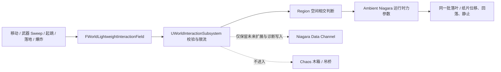

# 交互设计日志 | 2026-08-09

> 主题：Niagara 常驻地表轻质杂物交互
> 视角：大世界物理交互策划 / 技术美术（物理方向）
> 引擎：Unreal Engine 5.8
> 当前定位：营地垂直切片 P0，不以当前场景直接宣称完成大世界验证

## 今日目标

今天解决的不是“角色动作触发一团落叶特效”，而是让场景里原本就存在的落叶和纸片成为环境的一部分：玩家经过、挥刀、起跳、落地或制造爆炸时，同一批地表杂物被带动；外力结束后，它们重新落地、减速并恢复安静，等待下一次交互。

这套系统需要同时满足五个体验要求：

1. **环境先于玩家存在**：没有输入时，地面上也应有受控数量的杂物，而不是玩家触发后才凭空出现；
2. **反馈强度有层级**：行走、奔跑、起跳、落地、攻击和爆炸不能只是同一效果换颜色；
3. **方向可以读懂**：攻击应沿真实刀路带动粒子，不能只做以角色为中心的圆形排斥；
4. **结束后能安静**：粒子不能无限漂浮、反弹或原地旋转，但落地后仍要能再次被唤醒；
5. **不污染玩法物理**：调落叶不能改变木箱、吊桥或角色的 Chaos 冲量和操作手感。

## 本轮运行规则与目标反馈

下表是已经接入运行时的行为规则，不把无头 PIE 当成最终画面证明。当前自动化可以确认事件、方向、覆盖、参数和预算；粒子是否真正自然回落、停止自转以及各行为强弱是否舒服，仍需有渲染 PIE 验收。

| 玩家行为 | 轻质杂物回应 | 设计意图 |
|---|---|---|
| 原地站立 | 维持常驻总量，逐步落地并安静 | 环境不是循环播放的高频动效 |
| 行走 | 脚边小范围、低抬升、短距离滑动 | 给出存在感，但不抢玩家注意力 |
| 奔跑 | 范围与强度高于行走，方向跟随真实速度 | 用环境反馈放大移动速度变化 |
| 起跳 | 脚下产生一次短促扰动 | 表达蹬地，不与落地共用同一强度 |
| 落地 | 根据落地前垂直速度产生径向冲击 | 让重量和下落高度具有可读结果 |
| 空挥攻击 | 刀锋有效帧内也能带动环境粒子 | 环境反馈不依赖命中某个 Actor |
| 攻击扫过地面 | 先把贴地粒子掀起，再沿挥砍方向形成短尾流 | 读出刀路，而不是圆形爆炸 |
| 火球爆炸 | 大范围径向推开并抬升 | 与近战的定向反馈形成层级差异 |
| 外力结束 | 受重力、阻力和碰撞控制回落并减速 | 场景恢复可读的静止基线 |

## 核心设计决定

### 1. 从“事件生成粒子”改成“事件扰动环境”

早期实现把移动、攻击、落地和爆炸分别理解为一次 Niagara Burst。这个方案能快速看到反馈，但体验语义是错误的：玩家每次操作都会在脚边或刀边重新生成一批粒子，地上原有的杂物不受影响。结果看起来像技能附带的特效，而不是环境被玩家改变。

当前规则改为：

- 一个世界锚定的 `BP_LooseDebrisRegion` 持有常驻 Ambient Niagara System；
- Ambient 以稳定速率补充粒子，目标常驻预算为 `450`，单粒子寿命约 `30s`；
- 移动、攻击、起跳、落地和爆炸只发布轻量交互场；
- Region 把交互场转换为 Ambient System 的运行时力参数；
- 交互期间不生成新的 Niagara System，专项验收要求 `interaction_systems=0`。

“常驻”指区域内的总体密度持续存在，不要求某一片叶子永久不销毁。粒子按寿命轮换，使总量受控；玩家交互影响的是当时已经存在于环境中的粒子。

### 2. 把表现物理与玩法物理分层

木箱和吊桥承担玩法语义：它们有真实刚体质量、约束、碰撞和可通行结果。落叶与纸片承担表现语义：它们用于放大速度、方向和冲击，不参与阻挡、伤害或网络权威判定。

因此本轮没有复用会执行 Overlap、接口路由和真实刚体冲量的 `SubmitWorldInteraction()`，而是新增轻量场协议：



当前 P0 的 Region 通过 Subsystem 委托直接接收场，并向 CPU Sim Ambient System 写 User 参数；这是当前粒子即时响应的唯一消费路径。Data Channel 只保留结构化写入和计数，作为诊断证据与后续 GPU / Islands 方案的迁移接口，当前没有 NDC Reader。

### 3. 输入沿用玩家已经掌握的操作

系统不增加“吹落叶”专用按键。交互来源全部复用既有行为：

- 移动组件提交上一位置、当前位置和真实水平速度；
- 战斗组件在武器 Active 帧提交刀根、刀尖、刀锋方向和端点位移；
- 起跳只提交一次蹬地事件；
- 落地使用接触前保存的垂直速度，而不是落地后已经归零的速度；
- 火球爆炸在标准化爆炸请求之外，再派生一个纯表现轻量场。

这使 Demo 的交互学习成本保持为零，也能证明同一角色输入可以同时驱动玩法物理和环境表现，而两者拥有独立参数。

## 行为规则拆解

### 移动：低抬升、连续但受限

移动场使用角色上一帧到当前帧的胶囊段，而不是只在脚底放一个球。这样高速移动时不会因为帧间距离产生明显空洞。

发布规则：

- 水平速度低于 `60cm/s` 不发布；
- 累计位移不足 `8cm` 不发布；
- 每个来源每帧最多一个 Movement Field；
- 强度在 Walk `120` 与 Run `360` 之间按速度插值；
- 作用半径 `180cm`，上抬基线 `45`，持续时间 `0.08s`。

移动的目标不是把叶片吹到空中，而是让玩家从脚边的轻微滑动和尾流读出速度。若玩家慢走时也出现大面积飞散，优先降低 `WalkStrength`、`MovementUpwardLift` 或 `MovementRadius`，不通过缩短粒子寿命掩盖问题。

### 起跳与落地：分开表达蹬地和重量

起跳与落地是两个独立来源：

- 起跳基线：半径 `170cm`、强度 `300`、上抬 `220`、持续 `0.12s`；
- 落地触发阈值：垂直速度 `220cm/s`；
- 落地半径 `240cm`，强度按垂直速度在 `450~1100` 之间映射；
- 落地上抬 `380`，持续 `0.16s`。

体验层级应满足：普通落地明显强于行走，重落地明显强于普通落地；起跳是短促蹬地，不能比高处落地更像爆炸。自动化能证明事件只发布一次和速度映射有效，最终强弱仍需要有渲染 PIE 以同一路线对比。

### 攻击：排斥负责掀起，吸引负责尾流

只使用径向排斥时，攻击效果会从刀身周围平均向外炸开，玩家看不出挥砍方向；只使用前方吸引时，贴地粒子又可能因为静摩擦和接触状态无法起步。

当前攻击由两股短时力叠加：

1. **释放力**：把力源放在地面下方并略微偏向刀路后方，以排斥方式先解除贴地状态；
2. **尾流力**：在刀锋方向前上方放置吸引点，把已经被掀起的粒子沿刀路牵引一小段。

关键参数：

| 参数 | 当前基线 | 体验作用 |
|---|---:|---|
| `AttackInteractionRadius` | `150cm` | 刀路周围的基础影响范围 |
| `AttackStrength` | `900` | 地面释放与整体扰动基线 |
| `AttackUpwardLift` | `320` | 把贴地粒子掀起的倾向 |
| `AttackSweepPaddingScale` | `0.35` | 高速刀锋帧间覆盖补偿 |
| `AttackMaxSweepPadding` | `100cm` | 防止异常帧把范围无限放大 |
| `AttackWakeForceScale` | `4.0` | 前方尾流牵引强度 |
| `AttackWakeRadiusScale` | `1.15` | 尾流覆盖宽度 |
| `AttackWakeForwardOffsetScale` | `0.85` | 吸引点位于刀路前方的距离 |
| `AttackWakeHeight` | `65cm` | 尾流目标离地高度 |
| `AttackWakeDuration` | `0.20s` | 刀路牵引保留时间 |

尾流拥有独立结束时间，不会因为角色下一帧继续移动而被 Movement Field 清零。攻击字段仍受“每来源每帧最多一个”限制，武器 Trace 的 7 个刀身采样和最多 8 个时间子步不会等比例放大 Niagara 事件数量。

### 爆炸：范围层级，不复刻近战尾流

爆炸从标准化爆炸交互派生球形轻量场：

- 强度使用玩法爆炸强度的 `0.35` 倍；
- 上抬使用 `0.45` 倍；
- 持续时间 `0.25s`；
- 不启用攻击专用的前方吸引点。

本轮修复了一个容易被忽略的空间问题：根据上抬比例向地下偏移 Point Force 时，力源可能被推到自身影响半径之外，导致理论上“更强”的爆炸反而覆盖不到地面粒子。现在力源偏移最多为作用半径的 `0.8R`，确保贴地杂物始终位于有效覆盖内。

## 落地、静止与再次唤醒

### 为什么没有直接让 Ambient 粒子进入 Niagara Rest State

对一次性 Burst 来说，碰撞后进入 Rest State 很合适；但 Ambient 粒子需要在静止后继续响应下一次外力。若把它们永久置为 Rest，Point Force 可能无法再次改变状态。

当前采用“视觉静止，但保持可交互”的折中：

- Ambient 使用 CPU Sim、Sprite Renderer、世界空间、Fixed Bounds 和碰撞；
- 重力让出生在空中的粒子回到地面；
- `AmbientRestitution=0`，避免接触面持续微弹；
- `AmbientRotationalDrag=8`，快速耗散角速度；
- Leaf / Paper 的持续 Rotation Strength 都设为 `0`；
- Resting / Bouncing Calming Rate 都为 `12`；
- Ambient 不进入不可再次唤醒的永久 Rest State；
- 下一次 Point Force 仍能移动已经贴地的粒子。

这次修改直接对应“落叶一直原地转圈”的问题。根因不是全局风，而是 Ambient 在没有真正休眠的情况下仍持续施加空气动力旋转，碰撞微速度又不断把能量送回角向求解。处理方式是关闭持续旋转驱动并增强角向耗散，而不是把所有交互力一起关掉；源码、资产迁移和无头参数验证已经完成，最终是否达到视觉目标仍以有渲染 PIE 为准。

### 配置迁移规则

Niagara 图和 DataAsset 可能早于 C++ 默认值存在，单改源码不会自动改写旧二进制资产。为防止“代码看起来修了，场景仍读旧值”，`DA_WorldLooseDebrisConfig` 增加 `AssetSchemaVersion`：

- 旧资产首次运行配置脚本时迁移到上述静止基线；
- 迁移完成后版本号递增；
- 后续再次运行脚本不会覆盖策划手调值；
- 专项 PIE 会拒绝未迁移的旧版本资产。

## 参数入口与手调顺序

主要入口：

```text
/Game/PhysicsWorldDemo/LooseDebris/Config/DA_WorldLooseDebrisConfig
```

建议每次只验证一个问题，并在修改后重新开始 PIE：

| 想解决的问题 | 优先调整 | 不建议先动 |
|---|---|---|
| 地面太空 / 太密 | `AmbientParticleBudget`、`AuthoredAmbientRadius` | 交互强度 |
| 行走几乎没反应 | `WalkStrength`、`MovementRadius` | 粒子寿命 |
| 奔跑像爆炸 | `RunStrength`、`MovementUpwardLift` | 重力 |
| 落地不够有重量 | `LandingMin/MaxStrength`、`LandingUpwardLift` | 攻击参数 |
| 攻击只向外炸 | `AttackWakeForceScale`、`ForwardOffsetScale` | 爆炸比例 |
| 攻击跟随太长 | `AttackWakeDuration` | Ambient 寿命 |
| 贴地粒子起不来 | `MinimumGroundReleaseOffset`、`InteractionForceScale` | 重新生成粒子 |
| 粒子落地还在转 | `AmbientRotationalDrag`、两类 `RotationStrength`、Calming Rate | 关闭整个交互系统 |
| 粒子弹跳不止 | `AmbientRestitution`、摩擦与 Calming | 缩短寿命强制删除 |

DataAsset 数值在 Region / Niagara Component 下次激活时读取，手调后应停止并重新开始 PIE。`ConfigurePhysicsWorldLooseDebris.ps1` 用于创建或迁移 Niagara 图、绑定 User 参数和保存资产；普通手感调整不应依赖修改 C++ 常量。

## 调试与验收

### 运行时可视化

```text
pw.LooseDebris.DrawFields 0/1
```

编辑器开发环境默认开启轻量场绘制，便于同时观察：

- Movement 胶囊和速度方向；
- Attack 刀身胶囊、释放力范围和尾流方向；
- Jump / Landing 球形范围；
- Explosion 径向范围；
- 力源是否位于覆盖半径内。

调试图形只解释“系统收到了什么”，不能证明最终粒子画面已经好看。粒子是否穿地、持续旋转、遮挡后跳变、密度是否自然，仍需有渲染 PIE 实际观察。

### 自动化门槛

`ValidatePhysicsWorldLooseDebrisPIE.ps1` 验证：

1. 配置、Data Channel、Ambient System 和 Region 引用有效；
2. 配置资产已经完成当前 Schema 迁移；
3. 玩家静止时不持续发布 Movement Field；
4. 移动、空挥攻击、起跳、落地和爆炸均发布正确来源；
5. Attack 激活独立方向尾流，目标位于刀路前上方；
6. 爆炸的力源偏移仍处于作用半径和 `0.8R` 上限内；
7. 同一来源每帧限流有效，超额字段有可观测丢弃计数；
8. 轻量场不增加 `ProcessedRequestCount`，不进入 Chaos 交互链；
9. 交互不会创建新 Niagara System，`interaction_systems=0`；
10. 交互位置经过地面投影，Ambient 粒子保持可再次受力。

本轮实测输出：

```text
stationary_fields=0
movement_fields=1
attack_fields=3
attack_wake=1
jump_fields=22
landing_fields=1
explosion_fields=1
interaction_systems=0
ndc_writes=28
budget_drops=1
ground_projected=1
ambient_rotation=0.00/0.00@8.00
lifecycle=0.4s->15.0s
chaos_requests=0
```

它证明所有生产者都能影响同一个 Ambient Region，攻击尾流与限流规则已生效，而且轻量场没有误入 Chaos 请求链。它不读取最终像素，因此不能据此宣布“落叶已经不转圈”或“尾流力度已经完美”。

无头 PIE 能证明协议、时序、预算和生命周期，没有渲染像素证据，不能替代 VFX 手感验收。最终视觉验收至少覆盖静止 15 秒、同路线走/跑、四段空挥、普通/高处落地、爆炸、多次重复唤醒和区域边缘。

## 失败迭代与设计结论

| 失败表现 | 根因 | 本轮处理 | 得到的规则 |
|---|---|---|---|
| 交互时重新出现一批粒子 | 把环境交互做成事件 Burst | 只扰动 Ambient 常驻粒子 | 环境对象必须先于玩家输入存在 |
| 移动/攻击/跳跃/爆炸都没反馈 | Niagara 模块参数绑定断线，但生成函数仍返回成功 | 绑定失败向上传播并让配置流程失败 | 工具的成功标记必须覆盖最终资产状态 |
| 调 DataAsset 没有效果 | 运行时值与 Niagara 图中旧 Rapid Iteration 值混用 | 统一 User 参数并增加资产迁移 | 可调参数必须有单一消费路径 |
| 落地粒子不再受影响 | 一次性 Rest / Burst 生命周期与常驻交互冲突 | Ambient 保持可交互，使用耗散实现视觉静止 | 静止不等于从系统中永久移除 |
| 攻击像圆形排斥 | 只有径向力，没有方向目标 | 叠加前上方短时吸引力 | 刀路需要方向性反馈，不只是强度更大 |
| 爆炸参数更强却没有反馈 | 地下力源偏移超过自身半径 | 偏移限制在 `0.8R` 内 | 调强度前先验证空间覆盖关系 |
| 落叶一直原地旋转 | Ambient 持续 Rotation Strength + 低角阻尼 + 碰撞微能量 | Rotation `0/0`、Rotational Drag `8`、Calming `12`、Restitution `0` | 恢复安静必须单独设计能量出口 |

## 当前边界

- 当前 Ambient 采用 CPU Sim，适合证明交互规则和调参链路，不宣称已经完成大世界 GPU 粒子扩量；
- Data Channel 已建立并写入，但当前没有 Reader；Region 只通过委托和 User 参数驱动 Ambient，Islands / GPU 消费仍需 A/B 测试；
- 当前叶片和纸片是低成本表现物，不具备真实 kg、阻挡、拾取和网络权威语义；
- 还没有提交固定硬件下的 Niagara Game / Render / GPU p50、p95 数据；
- 营地单区域通过不代表 World Partition 多 Cell、LWC 远原点和区域边缘已经验收；
- 无头 PIE 不检查最终画面，持续旋转修复仍应以实际有渲染 PIE 做最终观感确认。

## 面试讲解重点

可以用以下顺序介绍本轮工作：

1. 我先定义玩家应读到的环境语言，而不是先选 Niagara 模块；
2. 我把轻质杂物定义为表现物理，把木箱和吊桥保留为玩法物理，两套参数互不污染；
3. 我把事件 Burst 改成常驻总量，让同一批环境粒子可以被多次扰动；
4. 移动、攻击、起跳、落地和爆炸复用现有输入，并通过统一轻量场表达位置、方向、半径、强度和持续时间；
5. 攻击用地下排斥与前方吸引两股力组合，分别解决贴地释放和刀路尾流；
6. 我用限流、生命周期、资产 Schema 和无头 PIE 把效果调试变成可回归流程；
7. 我会明确说当前是 CPU Sim P0，GPU / Islands / World Partition 性能证据是下一阶段，而不是把未完成内容包装成成果。

## 下一步

1. 完成本轮旋转修复的有渲染 PIE 观察，确认静止 15 秒后无持续自转，同时能再次被攻击唤醒；
2. 固化走、跑、跳、落地、攻击、爆炸的同路线视频与参数快照；
3. 用 Niagara Debugger、`stat Niagara`、Unreal Insights 和固定硬件记录单区域基线；
4. 对 CPU Ambient 与 GPU + Data Channel 消费做相同场景 A/B 测试；
5. 扩展到相邻 Region、World Partition Cell 和远离原点位置，再讨论大世界规模化结论；
6. 保持角色输入载体冻结，把后续投入放到表面差异、全局风、草地和水体的统一环境语言。
