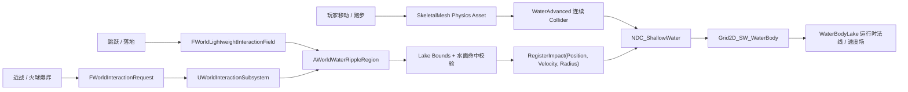

# 2026-08-10 交互设计日志：WaterAdvanced 双湖浅水交互

> 项目：UE5 开放区域物理交互 Demo<br>
> 方向：大世界交互策划 / 技术美术（物理方向）<br>
> 引擎：Unreal Engine 5.8<br>
> 关卡：`/Game/PhysicsWorldDemo/Maps/L_PhysicsWorldDemo_Lumen`<br>
> 状态：P0 已接通并通过人工体验；游泳、浮力、湿身与元素反应仍在后续阶段

---

## 1. 今日交付结论

今天把场景内已有的两个 `WaterBodyLake` 接入 UE 5.8 WaterAdvanced 浅水模拟，使水面不再只是静态景观，而是能够持续读取玩家行为并产生局部反馈。

已完成的可玩闭环：

| 玩家行为 | 水面反馈 | 输入方式 | 当前状态 |
|---|---|---|---|
| 行走 | 角色身体持续推开浅水，形成弱波纹 | SkeletalMesh 连续 Collider + Movement 轻量场 | 已验证 |
| 奔跑 | 方向一致、强于行走的连续波纹 | 身体速度 + Movement 速度映射 | 已验证 |
| 起跳 | 起跳位置产生一次较轻的扰动 | Jump 轻量场 | 已验证 |
| 落地 / 落水 | 按下落速度产生更大的波纹 | Landing / WaterEntry 一次性冲击 | 已验证 |
| 近战攻击 | 沿攻击方向向水面注入定向冲击 | Attack `RegisterImpact` | 已验证 |
| 火球爆炸 | 范围内产生大半径水面冲击 | Explosion `RegisterImpact` | 已验证 |

这次工作的核心价值不是“水面会动”，而是把角色移动、跳跃、战斗和爆炸四类语义接进同一套世界交互框架，并且保留不同来源独立调参的能力。

---

## 2. 体验目标

### 2.1 玩家应该感受到什么

1. 水面对角色存在有持续反馈，而不是只有攻击命中时才播放一个特效。
2. 走、跑、跳、落地、攻击和爆炸具有清晰的强度层级。
3. 波纹方向来自真实运动或攻击方向，不使用固定圆形贴花冒充物理反馈。
4. 玩家离开后，局部波动自然衰减，水面回到安静状态。
5. 反馈服务于探索和战斗阅读，不改变角色移动、跳跃高度或攻击手感。

### 2.2 P0 验收标准

| 维度 | 通过标准 |
|---|---|
| 连续性 | 在湖内持续行走和跑步时，身体附近持续有水面形变 |
| 层级 | 奔跑强于行走，落地强于普通起跳，爆炸覆盖大于近战 |
| 方向 | 移动波纹跟随速度，攻击波纹跟随刀路，爆炸为径向冲击 |
| 空间过滤 | 一个 Lake 的事件不会错误写入另一个 Lake 的 Region |
| 场景保护 | 不修改用户已经摆好的 Lake Transform、Spline 和基础材质 |
| 可调性 | 行为强度、半径、限频和模拟预算均有明确入口 |
| 回归 | C++ 编译、资产校验和双 Lake 无头 PIE 可重复通过 |

---

## 3. 场景接入策略

### 3.1 不重新造水面

早期原型验证过独立 `BP_Waterplane` 和自制 Render Target 波动方程，但主 Demo 最终没有替换场景水体，也没有为了接入交互重新雕刻 Landscape。

主场景继续使用现有的两个 `WaterBodyLake`：

- `WaterBodyLake`
- `WaterBodyLake2`

每个 Lake 对应一个 `AWorldWaterRippleRegion`。Region 只负责空间过滤、交互语义转换和转发，不拥有或修改 Lake 的美术布局。

### 3.2 为什么一湖一个 Region

WaterAdvanced 的浅水模拟是围绕玩家移动的局部 Grid2D，不适合把两个相距较远的 Lake 当成一个固定大纹理处理。Region 分开后可以做到：

- 每个事件先经过目标 Lake 的 Bounds 粗过滤；
- 再使用与插件一致的水面 Trace 确认真正命中目标 Lake；
- 矩形 Bounds 的空角不会误触发；
- Lake 之间不会串事件；
- 后续可为不同水域配置独立接收规则。

---

## 4. 运行时架构



### 4.1 两层输入，而不是一套冲击包打天下

水面输入被拆成两层：

| 层 | 适用行为 | 原因 |
|---|---|---|
| 连续身体碰撞 | 行走、跑步、角色在水中的持续位移 | 需要身体体积和速度连续推动水面，不能用低频事件代替 |
| 标准化一次性冲击 | 起跳、落地、攻击、爆炸 | 需要明确的时机、方向、半径和强度，适合通过协议转发 |

攻击有效并不代表移动链路有效。攻击只要 `RegisterImpact` 成功就能产生波纹，而移动还必须满足角色 Mesh、Physics Asset、运行时 Collider 标签和浅水 Niagara 消费链路全部正确。

### 4.2 系统职责

| 模块 | 职责 |
|---|---|
| `ARoverCharacter` / 战斗组件 | 只发布移动、跳跃、落地、攻击和爆炸语义，不持有 Lake 引用 |
| `UWorldInteractionSubsystem` | 分发重交互和轻量交互，保持来源与环境解耦 |
| `AWorldWaterRippleRegion` | 过滤空间、映射速度与半径、限频、去重并转发 WaterAdvanced |
| `UWorldWaterRippleConfig` | 保存水面交互、视觉、模拟和预算参数 |
| `UBasicShallowWaterSubsystem` | 驱动官方移动 Grid2D 浅水模拟 |
| `PHYS_Rover_Male` | 为角色连续涉水提供主要身体碰撞体积 |

---

## 5. WaterAdvanced 配置

工程显式启用 `Water` 与 `WaterAdvanced` 插件，使用官方：

- `/WaterAdvanced/Niagara/Systems/Grid2D_SW_WaterBody`
- `/WaterAdvanced/Niagara/DataChannels/NDC_ShallowWater`
- `UBasicShallowWaterSubsystem`

当前全局模拟参数：

| 参数 | 当前值 | 策划含义 |
|---|---:|---|
| `WorldGridSize` | `2400cm` | 玩家附近实时浅水窗口的世界尺寸 |
| `ResolutionMaxAxis` | `512` | 波纹空间精度与 GPU 成本的主要平衡项 |
| `OutputVelocity` | `true` | 输出速度场供水材质和后续响应使用 |
| `MaxActivePawnNum` | `6` | 同时参与浅水碰撞的 Pawn 预算 |
| `MaxImpulseForceNum` | `16` | 同时处理的一次性冲击预算 |
| `r.ShallowWater.FadeOutWait` | `15s` | 停止交互后模拟保持时间 |

### 5.1 WaterBodyCollision 修正

UE 5.8 的 `UBasicShallowWaterSubsystem::RegisterImpact` 内部通过 `ECC_WorldDynamic` 做阻挡 Trace。项目原碰撞配置不能保证该 Trace 命中 Lake，因此补齐 `WaterBodyCollision`：

- `WorldDynamic = Block`
- `Pawn = Overlap`
- `PhysicsBody = Overlap`
- `Destructible = Overlap`
- `Visibility / Camera = Ignore`

这项修正只服务于 WaterAdvanced 水面定位，不把 Lake 变成阻挡角色移动的实体墙。

---

## 6. 角色连续水面碰撞

### 6.1 最终根因

人工测试最初出现：

> 攻击水面有涟漪，但移动、跑步和跳跃没有可见反馈。

第一轮排查确认 Movement / Jump / Landing 请求都能进入 `RegisterImpact`，但这只能证明事件路由成功，不能证明 WaterAdvanced 的连续角色碰撞已建立。

最终定位：`SK_Rover_Male` 原本没有绑定 Physics Asset。

WaterAdvanced 会给满足条件的角色 SkeletalMesh 添加 `RigidMesh_ShallowWaterCollider` 标签，并读取 Physics Asset 生成浅水碰撞体。没有 Physics Asset 时，攻击事件仍然有效，但角色身体没有可用于持续推水的体积。

### 6.2 修复方案

新建并绑定：

`/Game/Rover/Character/PHYS_Rover_Male`

自动生成结果：

| 项目 | 结果 |
|---|---:|
| 主要身体碰撞体 | `14` 个胶囊 |
| Physics Constraint | `0` |
| 覆盖部位 | Pelvis、Spine、Head、UpperArm、Hand、Thigh、Calf 等 |
| 过滤部位 | 手指、细小发骨 |
| Simulate Physics | 不开启 |

该 Physics Asset 只提供浅水碰撞体积，不负责布娃娃，不改变角色 Capsule 的移动权威，也不会接管角色动画。

### 6.3 为什么生成器进入 Editor 模块

Physics Asset 自动生成依赖 `PhysicsUtilities`，属于资产生产工具，不应进入 Runtime 模块。实现放在 `RoverReplicaEditor`：

- `ConfigureRoverWaterAdvancedPhysicsAsset`
- `GetPhysicsAssetBodyCount`
- `Scripts/configure_rover_water_advanced_collider.py`

双 Lake 配置脚本会先确保 Physics Asset 存在并绑定，再配置场景 Region。这样重建环境资产时不会遗漏角色连续碰撞前置条件。

---

## 7. 行为语义与强度映射

### 7.1 行走与奔跑

- 连续反馈主要来自 Physics Asset Collider；
- Movement 轻量场提供项目统一的方向和速度语义；
- `MovementImpulseInterval` 控制补充事件频率；
- `MovementMinimumTravelDistance` 过滤原地小抖动；
- 奔跑通过真实速度自然获得强于行走的反馈。

### 7.2 起跳、落地与入水

- Jump 使用独立开关、半径与速度倍率，不复用 Attack；
- Landing 按下落速度映射冲击，不复用普通移动强度；
- WaterEntry 通过角色胶囊底部跨越水位判断，避免只靠 Overlap 造成重复水花；
- 深水中允许真实重叠角色的事件投影到水面，岸上事件仍受最大投影距离限制。

### 7.3 近战与爆炸

- Attack 使用攻击方向生成 Impact Velocity；
- Attack 有独立限频，避免一个武器 Sweep 的多个采样点在同帧重复放大水面能量；
- Explosion 使用独立冲击速度与半径倍率；
- 重交互 Request 和轻量 Explosion Field 做 RequestId / 同帧来源去重，避免同一次爆炸写入两次。

---

## 8. 调参入口

主要 DataAsset：

`/Game/PhysicsWorldDemo/Water/Config/DA_WorldWaterRippleConfig`

### 8.1 常用手感参数

| 目标 | 参数 | 调大后的结果 |
|---|---|---|
| 行走/跑步更明显 | `AdvancedMovementVelocityScale` | Movement 补充冲击速度更高 |
| 起跳更明显 | `AdvancedJumpVelocityScale` | 起跳冲击更强 |
| 落地更明显 | `AdvancedLandingVelocityScale` | 落地冲击更强 |
| 攻击更明显 | `AdvancedAttackVelocityScale` | 刀路冲击更强 |
| 爆炸更明显 | `AdvancedExplosionImpactSpeed` | 爆炸写入速度更高 |
| 行走覆盖更宽 | `MovementRadiusScale` | 单次 Movement 影响半径变大 |
| 起跳覆盖更宽 | `JumpRadiusScale` | 起跳影响半径变大 |
| 落地覆盖更宽 | `LandingRadiusScale` | 落地影响半径变大 |
| 攻击覆盖更宽 | `AttackRadiusScale` | 攻击影响半径变大 |
| 爆炸覆盖更宽 | `ExplosionRadiusScale` | 爆炸影响半径变大 |

### 8.2 过滤与稳定性参数

| 参数 | 作用 |
|---|---|
| `AdvancedMinimumImpactSpeed` | 过滤过弱的冲击，避免水面持续噪声 |
| `AdvancedMaximumImpactSpeed` | 限制异常速度，防止水面瞬间爆开 |
| `MovementImpulseInterval` | 控制 Movement 补充事件频率 |
| `MovementMinimumTravelDistance` | 过滤原地抖动与微小位移 |
| `SurfaceContactTolerance` | 自制 RT 后端的水面接触容差 |
| `MaximumSurfaceProjectionDistance` | 非真实水体重叠时允许投影到水面的最大距离 |

### 8.3 连续 Collider 偏弱时怎么调

如果确认运行时已有 `RigidMesh_ShallowWaterCollider`，但走跑仍然偏弱，应先检查：

1. `PHYS_Rover_Male` 主要胶囊是否真正接触水面；
2. WaterAdvanced Grid 是否跟随当前玩家；
3. WaterBody 材质是否消费官方 Normal / Velocity RT；
4. 最后再微调 Physics Asset 胶囊体积或 Movement 速度倍率。

不要用 `AdvancedAttackVelocityScale` 代偿移动问题。攻击和移动必须保持独立，否则会重新出现“攻击正常、移动失效但参数看起来都很大”的误判。

---

## 9. 编辑器脚本与资产生产

| 入口 | 用途 |
|---|---|
| `ConfigurePhysicsWorldDualLakeDemo.ps1` | 配置主 Demo 的双 Lake Region、Config 和角色水面 Collider |
| `configure_rover_water_advanced_collider.py` | 生成并绑定 Rover Physics Asset |
| `ConfigurePhysicsWorldWater.ps1` | 生成自制 RT 兼容后端及测试资产 |
| `ConfigurePhysicsWorldWaterPlaneDemo.ps1` | 配置独立 Water Plane 兼容测试场景 |

生成脚本遵守两条场景保护规则：

1. 已存在的 Lake、WaterZone 和 Region 不改 Transform；
2. 只有目标 Actor 缺失时才补建，避免重跑工具覆盖手工场景设计。

---

## 10. 自动化验证证据

### 10.1 已通过

| 验证 | 结果 |
|---|---|
| `BuildEditor.ps1` | Runtime / Editor 模块编译通过 |
| `ValidatePhysicsWorldDualLakeDemoAssets.ps1` | WaterZone、双 Lake、双 Region、Config、Physics Asset 绑定通过 |
| `ValidatePhysicsWorldDualLakePIE.ps1` | WaterAdvanced 子系统、Grid2D、Collider 标签、事件路由与跨区过滤通过 |

专项 PIE 最终证据：

```text
rover_collider=14bodies/tagged
movement=2
jump=2
attack=2
landing=2
explosion=2
cross_region_impacts=0
total_forwarded=[6, 5]
```

`total_forwarded=[6,5]` 中额外的一次来自角色真实移动事件，说明不再只是测试脚本手动注入冲击，角色实际移动已经进入官方浅水系统。

### 10.2 自动化覆盖修正

第一轮测试只断言 Movement / Jump 等请求进入 Region 并调用 `RegisterImpact`。这种验证会让“攻击可见、移动不可见”的问题看起来已经通过。

本轮新增三项断言：

1. `SK_Rover_Male` 必须绑定指定 Physics Asset；
2. Physics Asset Body 数量必须大于 0；
3. PIE 中角色 Mesh 必须获得 `RigidMesh_ShallowWaterCollider` 标签。

这次复盘形成的测试原则是：

> 环境交互不能只验证“请求发出”，还要验证接收端依赖的运行时载体真实存在。

### 10.3 已知非本任务失败

`ValidateRoverPIE.ps1` 仍会停在既有 ground jump 位移阈值断言。最近一次为 `dz=20.25cm`、`falling=True`。今天没有修改用户已经调好的跳跃参数，该失败不归因于 WaterAdvanced。

---

## 11. 从大世界交互策划角度的价值

### 11.1 把静态地貌变成行为反馈层

水体不再是只能看的材质，而是读取玩家移动、战斗和技能强度的环境反馈层。对开放区域探索而言，这类持续反馈能增强：

- 角色与场景的接触感；
- 走、跑、跳的速度差异阅读；
- 战斗动作的空间影响感；
- 水域作为特殊地表的辨识度。

### 11.2 复用既有交互协议

水面没有要求角色组件直接引用 WaterBody，也没有为攻击、跳跃各写一套关卡蓝图。它复用了：

- `FWorldInteractionRequest`
- `FWorldLightweightInteractionField`
- `UWorldInteractionSubsystem`
- `UPhysicsInteractable`

新增水面响应主要发生在环境接收端，证明协议可以从 Chaos、Niagara 地表杂物继续扩展到 WaterAdvanced。

### 11.3 参数属于体验层，而不是代码常量

走跑层级、攻击强度、爆炸范围、事件限频和模拟预算均可独立调整。策划可以在不重新编译 C++ 的情况下完成体验迭代，也不会因为放大攻击水花而意外改变角色移动或吊桥受力。

---

## 12. 当前边界

已经完成：

- 两个现有 Lake 的局部浅水互动；
- 行走、跑步、起跳、落地、攻击和爆炸反馈；
- 角色连续 Collider；
- 跨 Lake 过滤；
- DataAsset 调参；
- Editor Scripting 与无头 PIE 回归。

尚未完成：

- 游泳状态与水中移动；
- 木箱等物理对象的浮力；
- 出水湿身材质；
- 火、水、雷元素组合反应；
- 多个远距离水域同时保留独立高精度实时波场；
- World Partition 水域加载与正式 GPU 性能基线。

因此对外应表述为“WaterAdvanced 双湖局部浅水交互 P0”，不应直接表述为“完整开放世界水系统”。

---

## 13. 面试讲解提纲

可以按以下顺序讲：

1. **体验问题**：原场景水面只有视觉，没有角色持续接触反馈。
2. **系统选择**：保留现有 WaterBodyLake，用 UE 5.8 WaterAdvanced Grid2D 浅水系统，不重做水面美术。
3. **架构**：移动用连续 Physics Asset Collider，跳跃/落地/攻击/爆炸用标准化一次性冲击，统一进入 Niagara Data Channel。
4. **关键问题**：攻击有波纹但移动没有。最初只验证到 `RegisterImpact`，最终发现角色没有 Physics Asset。
5. **修复与工具化**：自动生成 14 个主要身体碰撞体，把 Physics Asset 绑定、Body 数量和运行时标签加入专项验证。
6. **策划价值**：行为强度分层、参数独立、场景无侵入、可扩展到游泳/浮力/元素反应。
7. **边界意识**：当前是玩家附近 24m 级局部模拟，不拿它冒充 World Partition 级大范围水域方案。

一句话总结：

> 我没有把水面做成一次性的技能特效，而是把它接成了一个持续读取玩家行为、可独立调参、可自动回归的环境反馈层。

---

## 14. 关键文件

| 类型 | 路径 |
|---|---|
| Runtime Region | `Source/RoverReplica/Public/WorldWaterRippleRegion.h` / `Private/WorldWaterRippleRegion.cpp` |
| 水面 Config | `Source/RoverReplica/Public/WorldWaterRippleConfig.h` |
| 调参资产 | `Content/PhysicsWorldDemo/Water/Config/DA_WorldWaterRippleConfig.uasset` |
| 角色 Physics Asset | `Content/Rover/Character/PHYS_Rover_Male.uasset` |
| 主 Demo 地图 | `Content/PhysicsWorldDemo/Maps/L_PhysicsWorldDemo_Lumen.umap` |
| 双 Lake 配置 | `Scripts/configure_physics_world_dual_lake_demo.py` |
| Collider 生成 | `Scripts/configure_rover_water_advanced_collider.py` |
| 资产验证 | `Scripts/validate_physics_world_dual_lake_demo_assets.py` |
| PIE 验证 | `Scripts/validate_physics_world_dual_lake_pie.py` |
| 完整实现规格 | `Docs/鸣潮水面复刻实现方案.md` |
