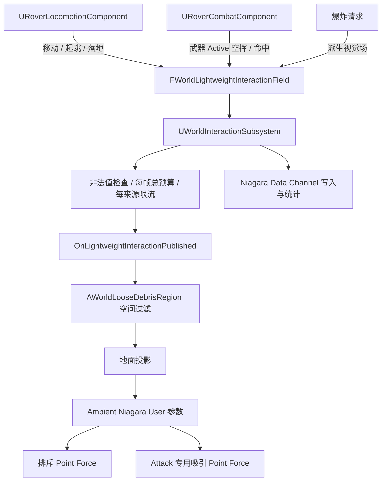

# Niagara 地表轻质杂物交互系统：当前实现与调参说明

> 文档状态：已落地 P0，不再是待实现方案
> 更新日期：2026-08-09
> 引擎：Unreal Engine 5.8
> 体验定位：开放区域中的常驻落叶 / 垃圾纸片表现物理

## 0. 先给结论

当前系统已经实现：

- 地面持续存在受控总量的落叶与纸片；
- 移动、攻击、起跳、落地和爆炸扰动同一套环境粒子；
- 交互不会重新生成 Niagara System；
- 已经落地的粒子仍可被下一次交互重新带动；
- 攻击同时使用“地下 / 后方排斥 + 前上方吸引”，形成沿刀路的短尾流；
- 外力结束后的重力、碰撞、阻力和 Calming 恢复链已经接入，最终静止姿态仍需有渲染 PIE 判断；
- Ambient 持续旋转驱动力已在源码和重建资产中关闭，无头 PIE 确认运行参数为 `0/0@8`，是否彻底消除原地转圈仍待有渲染确认；
- 粒子交互使用独立轻量协议，不会给木箱或吊桥施加 Chaos 冲量；
- 参数集中在 `DA_WorldLooseDebrisConfig`，旧资产通过 Schema 只迁移一次，之后保留策划手调值；
- Build、资产生成和无头 PIE 使用固定脚本，模块绑定失败会让流程真正失败。

当前实现不是最终大世界方案：Ambient 为 CPU Sim，当前即时反馈只走 Subsystem Delegate + Niagara User 参数；Niagara Data Channel 已写入和计数，但没有 Reader。GPU / Islands / World Partition 多区域必须经过同场景性能 A/B 后再升级。

## 1. 体验目标

### 1.1 玩家应该看到什么

系统的价值不是增加“落叶数量”，而是给玩家动作增加环境回声：

| 输入 | 反馈特征 | 不应出现 |
|---|---|---|
| 静止 | 粒子落地、减速、保持低噪声 | 无原因持续飞舞或自转 |
| 行走 | 局部、低抬升、短滑动 | 大面积清场 |
| 奔跑 | 强于行走，方向跟随真实速度 | 效果滞后追着角色跑 |
| 起跳 | 一次短促蹬地 | 连续喷发 |
| 落地 | 按下坠速度映射，强于普通移动 | 落地后每帧重复触发 |
| 攻击 | 沿真实刀锋轨迹，先掀起再牵引 | 只做角色中心圆形排斥 |
| 爆炸 | 大范围径向推开和抬升 | 复用近战方向尾流 |
| 交互结束 | 自然沉降并恢复安静 | 缩短寿命后突然消失 |

### 1.2 语义边界

普通落叶和纸片是**视觉物理代理**：

- 不提供阻挡；
- 不承担伤害；
- 不参与权威游戏状态；
- 不宣称具有真实 kg；
- 不逐粒子网络同步；
- 不通过真实刚体冲量反向影响角色、木箱和吊桥。

需要拾取、阻挡或持续玩法状态的重点垃圾，应另做 Chaos Actor 或交互 Actor，不应把普通 Niagara 粒子升级成伪刚体系统。

## 2. 当前运行链



### 2.1 为什么不用标准 World Interaction 请求

标准 `FWorldInteractionRequest` 会解析表面、查找接收者、调用 `UPhysicsInteractable` 并可能施加真实刚体冲量。若移动每帧复用这条链，会产生三个问题：

1. 查询和路由成本高于轻质表现所需；
2. 角色经过落叶区域时可能意外推动木箱或吊桥；
3. Niagara 手感参数与 Chaos 玩法参数耦合。

轻量场只表达位置、方向、速度、半径、强度、上抬、持续时间和来源类型。Subsystem 发布后不做 Overlap，不执行物理接口，不施加 Chaos Impulse。

### 2.2 Data Channel 当前承担什么

`NDC_LooseDebrisInteraction` 当前仍接收结构化字段并记录写入次数，用于：

- 验证生产者确实发布了字段；
- 保持未来 Niagara GPU 消费接口；
- 为 Data Channel Islands 评估保留迁移路径。

当前 CPU Ambient 的即时反馈主要通过 Subsystem 委托到 Region，再由 Region 设置 Niagara User 参数。文档和面试中不能把当前实现描述为“GPU 粒子直接消费 NDC”。

## 3. 资产组成

```text
Content/PhysicsWorldDemo/LooseDebris/
├── Blueprints/BP_LooseDebrisRegion
├── Config/DA_WorldLooseDebrisConfig
├── DataChannels/NDC_LooseDebrisInteraction
├── EffectTypes/NET_LooseDebris
├── Materials/M_LooseDebris_Leaf
├── Materials/M_LooseDebris_Paper
└── Niagara/Systems/
    ├── NS_LooseDebris_Ambient
    ├── NS_LooseDebris_Movement
    ├── NS_LooseDebris_Attack
    ├── NS_LooseDebris_Landing
    └── NS_LooseDebris_Explosion
```

五个 System 都由生成器创建并保持资产引用有效，但当前运行时只激活 Ambient。Movement / Attack / Landing / Explosion System 是预留模板和未来对比资产；专项验收要求交互期间活动额外 System 数为 `0`。

## 4. Ambient Niagara 规格

### 4.1 System / Emitter

- 一个 Ambient System；
- 两个共享结构的 Emitter：Leaf 和 Paper；
- `ENiagaraSimTarget::CPUSim`；
- World Space，`bLocalSpace=false`；
- Fixed Bounds，避免依赖动态 Bounds 造成离屏裁剪跳变；
- Sprite Renderer + Two Sided Masked 材质；
- Leaf / Paper 使用独立 Spawn Rate、Rotation Strength 和 Drag User 参数；
- Wind Force 模块在生成阶段显式禁用；
- Ambient 每个 Emitter 有两个 V2 Point Attraction Force：通用释放力和 Attack 尾流力。

### 4.2 稳态总量

Ambient 不一次性生成 450 个永久粒子，而是按预算和寿命计算持续生成率：

```text
总 Spawn Rate = AmbientParticleBudget / AmbientParticleLifetime
               = 450 / 30
               = 15 粒子/秒（约）
```

其中 Paper 比例当前为 `0.30`。粒子寿命带少量 `0.9~1.1` 随机范围，避免整批同时替换。这样区域内总体密度长期稳定，又能控制峰值和更新换代。

### 4.3 出生与地面

- Ambient 的 XY 分布半径为 `1200cm`；
- 粒子使用世界重力 `-980cm/s²`；
- 出生在空气中的粒子会通过碰撞落到地面；
- Region 的交互中心先向上 `150cm`、向下 `1200cm` 做地面投影；
- 成功命中后在表面上方 `3cm` 使用交互位置；
- 没有命中时回退到 Region 基准高度，不将交互点留在角色胶囊中心或半空。

### 4.4 静止但可再激活

Ambient 关闭永久 Rest State，因为粒子落地后仍要响应下一次外力。静止依赖以下参数：

| 参数 | 当前值 | 作用 |
|---|---:|---|
| `AmbientGravityZ` | `-980` | 把悬空粒子拉回地面 |
| `AmbientAerodynamicDrag` | `0.35` | 耗散线速度 |
| `AmbientRotationalDrag` | `8.0` | 快速耗散角速度 |
| `AmbientLeafRotationStrength` | `0.0` | 关闭落叶持续空气动力旋转 |
| `AmbientPaperRotationStrength` | `0.0` | 关闭纸片持续空气动力旋转 |
| `AmbientRestingCalmingRate` | `12.0` | 清除接触后的微小抖动 |
| `AmbientBouncingCalmingRate` | `12.0` | 清除碰撞阶段的残余能量 |
| `AmbientRestitution` | `0.0` | 避免地面微弹持续喂给旋转求解 |

这组数值用于解决“落叶一直转圈”。当前已经完成源码默认值、运行时 User 参数、旧资产迁移和资产重建，无头 PIE 已确认 Ambient 读取 `0/0@8`；是否达到最终视觉目标仍需在有渲染 PIE 中静止观察至少 `15s`。若未来需要空中翻摆，应优先只在明确 Airborne 条件下增加旋转，而不是重新给所有 Ambient 粒子持续 Rotation Strength。

## 5. 轻量交互字段

### 5.1 数据结构

`FWorldLightweightInteractionField` 当前包含：

| 字段 | 语义 |
|---|---|
| `SourceActor / SourceId` | 来源和每来源预算身份 |
| `SourceType` | Movement / Attack / Jump / Landing / Explosion |
| `ShapeType` | Sphere / Capsule |
| `Start / End` | 球心或胶囊段 |
| `Direction` | 玩家速度、刀锋或爆炸方向 |
| `SourceVelocity` | 真实来源速度，用于诊断和未来映射 |
| `Radius` | 基础空间范围 |
| `Strength` | 视觉扰动力，不是 Chaos Impulse |
| `UpwardLift` | 掀起倾向 |
| `Duration` | 场保持时间 |
| `FalloffExponent` | 协议层衰减信息 |
| `SwirlStrength` | 协议预留的切向信息 |

当前 Ambient Region 实际消费位置、方向、半径、强度、上抬、持续时间和 SourceType。字段级 `FalloffExponent` / `SwirlStrength` 仍主要用于 Data Channel 与未来扩展；当前 Point Force 使用全局 `InteractionForceFalloffExponent`，因此手调 `MovementFalloffExponent`、`AttackFalloffExponent` 或 `AttackSwirlStrength` 不应被当作当前画面主入口。

### 5.2 校验与预算

Subsystem 拒绝：

- NaN 位置、方向和速度；
- 非有限半径、强度、上抬、持续时间；
- 半径或持续时间不大于零；
- 负强度；
- 未启用配置或无有效 World。

预算：

| 参数 | 当前值 |
|---|---:|
| `MaxFieldsPerFrame` | `12` |
| `MaxMovementFieldsPerSourcePerFrame` | `1` |
| `MaxAttackFieldsPerSourcePerFrame` | `1` |

超出预算的字段返回失败并增加 dropped 计数。武器 Trace 的空间采样数不会直接变成相同数量的 Niagara 场。

## 6. 各来源规则与当前参数

### 6.1 Movement

| 参数 | 当前值 | 含义 |
|---|---:|---|
| `MovementMinSpeed` | `60cm/s` | 低于该速度不发布 |
| `MovementReferenceSpeed` | `600cm/s` | 走跑插值的参考上限 |
| `MovementPublishDistance` | `8cm` | 位移不足时不发布 |
| `MovementRadius` | `180cm` | 胶囊场半径 |
| `WalkStrength` | `120` | 慢速基线 |
| `RunStrength` | `360` | 高速基线 |
| `MovementUpwardLift` | `45` | 低幅抬升 |
| `MovementFieldDuration` | `0.08s` | 单次场持续时间 |

速度在阈值与参考速度之间映射到 Walk / Run，Upward Lift 同时由约 `0.45~1.0` 倍插值。移动使用上一位置到当前位置的 Capsule，减少高速帧间空洞。

### 6.2 Attack

| 参数 | 当前值 | 含义 |
|---|---:|---|
| `AttackInteractionRadius` | `150cm` | 刀身基础影响范围 |
| `AttackSweepPaddingScale` | `0.35` | 端点帧间位移补偿比例 |
| `AttackMaxSweepPadding` | `100cm` | 补偿上限 |
| `AttackStrength` | `900` | 通用释放力基线 |
| `AttackUpwardLift` | `320` | 贴地释放倾向 |
| `AttackFieldDuration` | `0.12s` | 排斥力最低来源时长 |
| `AttackWakeForceScale` | `4.0` | 前方吸引强度倍率 |
| `AttackWakeRadiusScale` | `1.15` | 尾流半径倍率 |
| `AttackWakeForwardOffsetScale` | `0.85` | 尾流目标前移距离 |
| `AttackWakeHeight` | `65cm` | 尾流目标高度 |
| `AttackWakeFalloffExponent` | `0.65` | 尾流衰减曲线 |
| `AttackWakeDuration` | `0.20s` | 尾流独立保留时间 |

攻击方向来自刀根 / 刀尖的真实帧间运动。没有 Actor 命中时也发布，因此空挥能够作用于环境。

### 6.3 Jump / Landing

| 参数 | 当前值 | 含义 |
|---|---:|---|
| `JumpRadius` | `170cm` | 蹬地范围 |
| `JumpStrength` | `300` | 蹬地扰动 |
| `JumpUpwardLift` | `220` | 起跳抬升 |
| `JumpFieldDuration` | `0.12s` | 起跳时长 |
| `LandingMinVerticalSpeed` | `220cm/s` | 落地触发阈值 |
| `LandingReferenceSpeed` | `1400cm/s` | 强度映射上限参考 |
| `LandingRadius` | `240cm` | 落地范围 |
| `LandingMinStrength` | `450` | 普通落地基线 |
| `LandingMaxStrength` | `1100` | 高速落地上限 |
| `LandingUpwardLift` | `380` | 落地抬升 |
| `LandingFieldDuration` | `0.16s` | 落地场时长 |

落地使用接触前缓存的垂直速度。低于阈值不发布，避免台阶和坡面产生连续落地 Burst。

### 6.4 Explosion

| 参数 | 当前值 | 含义 |
|---|---:|---|
| `ExplosionStrengthScale` | `0.35` | 玩法爆炸强度到视觉场的转换倍率 |
| `ExplosionUpwardLiftScale` | `0.45` | 玩法爆炸上抬转换倍率 |
| `ExplosionFieldDuration` | `0.25s` | 爆炸场时长 |

爆炸不使用 Attack Wake。它表达的是大范围径向事件，不应沿某一刀路吸引粒子。

## 7. 通用 Point Force

### 7.1 贴地释放

Niagara 的 Point Attraction Force 使用正值吸引、负值排斥。通用场写入负强度：

```text
RepulsionStrength = -Field.Strength * InteractionForceScale
```

力源从地表向来源方向后方和地下偏移，使排斥向量同时包含前向与上向分量。当前参数：

| 参数 | 当前值 | 作用 |
|---|---:|---|
| `InteractionForceScale` | `10.0` | 视觉场到 Niagara Force 的倍率 |
| `InteractionForceRadiusScale` | `2.0` | 输入半径到实际 Point Force 半径的倍率 |
| `InteractionDirectionalBias` | `0.35` | 力源向后偏移，增强前向反馈 |
| `InteractionUpwardBiasScale` | `1.0` | 按上抬 / 强度比例决定地下偏移 |
| `MinimumGroundReleaseOffset` | `45cm` | 即使上抬很低也能解除贴地接触 |
| `MaxForceOriginOffsetRatio` | `0.8` | 力源偏移不超过自身半径的 80% |
| `InteractionForceFalloffExponent` | `0.5` | 当前通用力衰减 |
| `MinimumInteractionForceDuration` | `0.18s` | 防止单帧设置短到没有可见反馈 |

### 7.2 Attack Wake

Attack 额外写入正强度吸引点：

```text
WakeTarget = GroundLocation
           + AttackDirection * Radius * ForwardOffsetScale
           + UpVector * WakeHeight

WakeStrength = Field.Strength * AttackWakeForceScale
```

通用排斥先释放地面接触，前上方吸引再塑造刀路。两股力有独立结束时间；任何一个仍活动时 Region 继续 Tick，到期后把对应 Strength 清零。

## 8. 参数是否会生效

### 8.1 当前 Ambient 直接消费的参数

以下是手调主入口，修改后停止并重新开始 PIE：

- `RegionExtent`、`AuthoredAmbientRadius`；
- `AmbientParticleBudget`、`PaperParticleFraction`、`AmbientParticleLifetime`；
- Ambient Gravity / Drag / Rotation / Calming / Restitution；
- Movement、Attack、Attack Wake、Jump、Landing、Explosion 字段参数；
- Interaction Force、Ground Trace、预算和调试参数。

### 8.2 当前不应作为画面调参入口的参数

以下参数仍为 4 个预留 Interaction System 的生成模板保留，但当前运行时要求 `interaction_systems=0`，因此修改它们不会改变 Ambient 粒子的当前交互：

- `Movement/Attack/Landing/ExplosionParticleBudget`；
- `Movement/Attack/Jump/Landing/ExplosionInteractionSpawnRate`；
- `InteractionParticleLifetime`、`InteractionEmissionTail`；
- 各类 `SpawnRadius`；
- 各类 `InitialSpeed`、`InitialVelocityConeAngle`、`InitialVelocityUpwardRatio`；
- `InteractionGravityZ`、Interaction Drag / Lift / Friction / Rest State 参数；
- `Movement/Attack/Jump/Landing/ExplosionBurstInterval`；
- 已 Deprecated 的 System Scale 参数。

这些字段后续应在“彻底删除预留 System”或“重新启用事件 System 做对照”时统一清理。当前保留是为了资产生成兼容，不代表它们是有效的 Ambient 手感参数。

### 8.3 配置与资产迁移

运行：

```powershell
powershell -File Scripts/ConfigurePhysicsWorldLooseDebris.ps1
```

脚本负责：

- 创建 / 校验 Data Channel、Effect Type、材质、五个 Niagara System；
- 确保 Ambient 每个 Emitter 都有两个 V2 Point Force；
- 绑定所有 Runtime User 参数；
- 绑定失败时返回失败，不再 `ensure` 后继续假成功；
- 迁移旧 DataAsset 的 Ambient 旋转静止基线；
- 保存 BP、DA、Niagara 和关卡 Region 引用。

`AssetSchemaVersion` 只让旧资产迁移一次。完成后再次运行不会重置策划手调值。

## 9. 调试可视化

```text
pw.LooseDebris.DrawFields 0/1
```

调试应检查：

- 字段中心是否投影到地面；
- Movement Capsule 是否覆盖帧间移动；
- Attack Capsule 是否沿刀身而不是角色胶囊；
- Repulsion Force Origin 是否在地面下方且仍处于半径内；
- Attack Wake Target 是否在刀路前上方；
- Jump / Landing 是否只各发布一次；
- Explosion 是否为径向范围；
- dropped / rejected / NDC write 计数是否符合预算。

编辑器调试图形默认开启，Shipping 默认关闭。Debug Draw 解释输入场，不解释最终粒子状态。

## 10. 自动化验收

```powershell
powershell -File Scripts/BuildEditor.ps1
powershell -File Scripts/ConfigurePhysicsWorldLooseDebris.ps1
powershell -File Scripts/ValidatePhysicsWorldLooseDebrisPIE.ps1
powershell -File Scripts/ValidateRoverPIE.ps1
```

Loose Debris 专项验证：

1. Config、Schema、Data Channel、System、BP、Region 有效；
2. 静止角色不发布 Movement Field；
3. 移动字段发布且 Region 收到；
4. 空挥 Attack 字段发布，方向尾流激活；
5. 起跳和落地字段各触发一次；
6. Explosion 字段写入 NDC；
7. Point Force 原点位于半径和 `0.8R` 偏移限制内；
8. 每来源限流丢弃数正确；
9. 交互不会增加 Chaos Processed Request；
10. 不创建额外 Niagara System，`interaction_systems=0`；
11. 交互位置完成地面投影；
12. 原角色移动、跳跃和攻击状态不回归。

2026-08-09 最新专项输出：

```text
stationary_fields=0 movement_fields=1 attack_fields=3 attack_wake=1
jump_fields=22 landing_fields=1 explosion_fields=1 interaction_systems=0
ndc_writes=28 budget_drops=1 ground_projected=1 chaos_requests=0
ambient_rotation=0.00/0.00@8.00 lifecycle=0.4s->15.0s
```

无头 PIE 不渲染最终画面。它不能检查粒子是否仍持续自转、材质是否穿帮、密度是否自然或尾流是否太强。

## 11. 有渲染 PIE 验收路线

| Case | 操作 | 通过条件 |
|---|---|---|
| V01 静止 | 站立 `15s` | 无持续自转、漂浮和高频抖动 |
| V02 再激活 | 静止后走过并挥刀 | 已贴地粒子能再次被带动 |
| V03 走 / 跑 | 同路线各一次 | 跑明显强于走，但不清空整个区域 |
| V04 空挥 | 原地不同方向攻击 | 反馈沿真实刀锋方向 |
| V05 攻击停手 | 单次攻击后等待 | 尾流按短周期结束，不继续吸附 |
| V06 起跳 / 落地 | 原地跳和高处落地 | 层级清楚，事件不重复 |
| V07 爆炸 | 火球命中区域 | 范围大于近战，方向呈径向 |
| V08 边缘 | 穿过 Region 边界 | 系统不跟随玩家滑动，不整块跳变 |
| V09 遮挡 | 粒子飞过遮挡并返回视野 | 无明显穿地或突然位置修正 |
| V10 压力 | 连续移动、攻击、爆炸 | 总量、System 数和临时对象不持续增长 |

## 12. 性能与规模化门槛

当前不能只凭“450 粒子运行正常”宣称大世界可用。下一阶段需固定：

- CPU / GPU / RAM；
- 分辨率与画质；
- Development 独立进程和 Shipping；
- Region 数量与每区域粒子预算；
- 固定 30 秒以上相机 / 操作路线；
- Frame / Game / Render / GPU 的 p50、p95、峰值；
- Niagara Sim、Sprite Renderer、材质 Overdraw 和碰撞成本；
- 0 交互、单角色持续移动、多来源峰值三种负载；
- CPU Ambient 与 GPU + NDC 消费的同场景 A/B；
- World Partition Cell 加载卸载、区域边缘和 LWC 远原点测试。

只有性能数据支持时，才将 Region 从当前 CPU P0 迁移到 GPU / Data Channel Islands。技术名词不是升级理由。

## 13. 已知边界与技术债

- 预留 Interaction System 及其参数仍存在，但当前不激活，DataAsset 有可编辑但不会影响 Ambient 的字段；
- 字段级 `FalloffExponent` / `SwirlStrength` 尚未完整进入 Ambient 两股力计算；
- Ambient 通过持续耗散实现视觉静止，不是显式 Grounded / Airborne / Settling 状态机；
- 当前地面投影由 CPU Trace 确定交互中心，粒子自身碰撞仍需复杂地形视觉检查；
- 单 Region 固定 Bounds 尚未验证多层建筑、跨 Cell 和远离世界原点；
- 当前材质与叶片 / 纸片 Sprite 轮廓为功能质量，不作为最终美术成果；
- 性能预算和质量档位还没有固化成 Effect Type 的正式平台配置。

## 14. 关键文件

```text
Source/RoverReplica/Public/WorldLooseDebrisConfig.h
Source/RoverReplica/Public/WorldLooseDebrisRegion.h
Source/RoverReplica/Private/WorldLooseDebrisRegion.cpp
Source/RoverReplica/Public/WorldInteractionTypes.h
Source/RoverReplica/Public/WorldInteractionSubsystem.h
Source/RoverReplica/Private/WorldInteractionSubsystem.cpp
Source/RoverReplica/Private/RoverLocomotionComponent.cpp
Source/RoverReplica/Private/RoverCombatComponent.cpp
Source/RoverReplicaEditor/Private/RoverEditorTestLibrary.cpp
Scripts/configure_physics_world_loose_debris.py
Scripts/validate_physics_world_loose_debris_pie.py
```

## 15. 设计复盘

这套系统最重要的产出不是一个 Niagara Asset，而是三条可以继续复用的规则：

1. **环境反馈应扰动已存在的世界状态，而不是每次输入重新制造一份假环境；**
2. **表现物理与玩法物理可以共享输入协议，但必须拆开预算、强度和生命周期；**
3. **“恢复静止”与“仍可再次交互”是两个独立需求，需要专门设计能量出口和唤醒路径。**

这三条规则后续可以继续用于草地弯曲、水面涟漪、尘土、布料、可移动垃圾和全局风，而不必让角色组件直接认识每一种环境对象。
