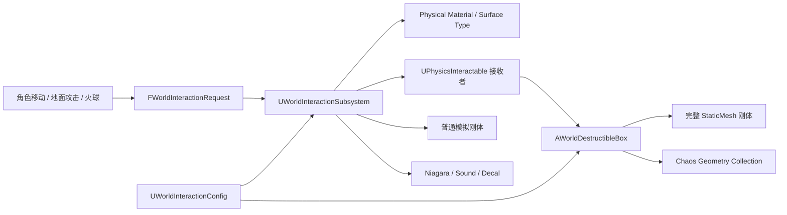

# 开放区域物理交互 Demo：项目介绍与阶段总结

> **历史快照说明（2026-08-09）**：本文主体保留 2026-08-07 阶段记录，其中连击段数、旧吊桥峰值、木箱破裂质量模式和 Niagara 数量不再代表当前版本。吊桥后续已完成攻击响应分层：Attack 最大 `158.8cm/s`、Landing `309.2cm/s`、比值 `0.514`，并保留 `18.7cm` 桥上攻击推进。最新作品集介绍以根目录 `README.md`、`Docs/物理吊桥系统说明.md`、`Docs/InteractionDesignLog-2026-08-09-RopeBridgeAttackResponse.zh-CN.md` 与 `Docs/大世界物理交互Demo开发规划.md` 为准。

> 项目代号：RoverReplica / PhysicsWorldDemo  
> 工程名称：鸣潮复刻  
> 引擎版本：Unreal Engine 5.8  
> 当前版本：P0 物理交互垂直切片  
> 更新日期：2026-08-07  
> 目标方向：大世界表现与交互 / 技术美术（物理方向）

## 0. 文档用途

这份文档同时服务于两种场景：

- 对外介绍：用于转岗沟通、简历项目描述、面试讲解和演示视频脚本；
- 内部记录：用于保存当前完成范围、技术证据、已知不足和后续计划。

对外介绍时建议优先使用第 1 至第 8 节；需要展开工程细节、复现流程或后续规划时，再使用第 9 节以后内容。

## 1. 项目简介

### 1.1 一句话介绍

这是一个基于 UE 5.8 的第三人称开放区域物理交互 Demo：使用现有角色移动与地面战斗作为输入载体，通过标准化交互协议驱动 Chaos 刚体/破坏、Physical Material 表面识别、Niagara 和灼烧贴花，并用自动化 PIE 测试证明交互结果可复现。

### 1.2 30 秒介绍

> 我在 UE 5.8 中制作了一个面向大世界交互策划 / 物理交互方向的可玩垂直切片。玩家沿用近战、火球、移动和跳跃操作，让环境以破裂、范围反馈、承重、余振和浅水波纹回应。当前已完成一刀破箱、火球触发多箱破坏、常驻地表杂物交互、60 板双侧约束吊桥，以及两个现有 WaterBodyLake 的 WaterAdvanced 局部浅水交互。角色和动作来自第三方素材，我的工作重点是交互规则、体验分层、参数设计、UE 原型实现与自动化验收。

### 1.3 项目定位

| 项目项 | 当前定义 |
|---|---|
| 项目类型 | 可玩的技术美术 / 物理交互作品集垂直切片 |
| 当前核心 | 让命中、范围技能和角色运动形成可读、可调、可验证的环境反馈 |
| 角色作用 | 稳定的第三人称交互载体，不再追求完整复刻原作玩法 |
| 技术重点 | Chaos、Geometry Collection、Niagara、WaterAdvanced、数据驱动、自动化验证 |
| 当前场景规模 | 5 个可破坏箱子 + 1 座 60 板动态吊桥 + 2 个可交互 WaterBodyLake |
| 当前阶段 | 破坏、动态路径、常驻地表杂物与双湖浅水交互 P0 完成 |

## 2. 项目背景与目标调整

项目最初用于学习并复刻《鸣潮》漂泊者的移动和战斗表现。随着角色移动、相机和地面轻攻击三连逐渐稳定，项目目标调整为更适合转岗展示的方向：

> 保留角色系统作为可操作入口，把主要开发投入转向开放区域物理交互、环境表现和可度量的工程证据。

这个调整解决了两个问题：

1. 避免继续堆叠完整角色玩法，却无法形成明确的岗位能力标签；
2. 把角色、战斗、Chaos、Niagara、材质和自动化工具串成一个可以现场演示和深入讲解的技术闭环。

最终目标不是宣称已经完成“大世界”，而是先完成一个质量足够、参数可解释、结果可复现的营地垂直切片。当前已加入 WaterAdvanced 局部浅水交互 P0；后续继续补全全局风、Chaos Cloth、草地、游泳/浮力/水元素反应、PCG、World Partition 和 HLOD。

## 3. 我的工作与资产边界

### 3.1 工程实现范围

- 设计并实现角色移动、动画、战斗与环境交互之间的 C++ 模块边界；
- 构建地面移动、跳跃、落地、急停、转身和地面轻攻击三连的运行时逻辑；
- 使用 AnimMontage、AnimNotifyState、Root Motion 和由脚本生成的 AnimBP 完成动作接入；
- 设计 `FWorldInteractionRequest`、`UPhysicsInteractable` 和 `UWorldInteractionSubsystem`；
- 实现火球、爆炸、表面识别、可破坏木箱、逐实例质量和统一重力；
- 构建 Geometry Collection 生成、碰撞数据、材质 Usage 和生命周期处理；
- 使用 Python + Editor C++ 生成/配置资产，并使用 PowerShell 包装构建和验证流程；
- 建立角色、战斗、动画和物理交互的无头 PIE 自动化回归。

### 3.2 第三方资产说明

漂泊者角色模型、原始动作和武器源文件来自第三方角色/动作素材包，不作为原创美术成果申报。当前木箱材质和贴花仍处于 P0 视觉质量；Niagara 已完成 4 个功能系统的运行时装配，不再是通用占位效果，但也不作为最终美术成果申报。

作品集需要明确强调的个人贡献是：

- 系统架构与 C++ 运行时实现；
- 动画与输入系统接入；
- Chaos 破坏和刚体交接；
- Python 编辑器工具与资产管线；
- 参数化、调试可视化和自动化验证；
- 技术问题定位、取舍和量化证据整理。

## 4. 当前可玩内容

### 4.1 角色移动与动画底座

当前已完成并接入：

- Idle / Walk / Run / Sprint 步态；
- 方向移动 BlendSpace；
- 起跳、跑跳、二段跳、普通下落和快速下落；
- Light / Heavy / Roll 三类落地反馈；
- Sprint 180 度回身与惯性恢复；
- Walk / Run / Sprint 左右脚急停；
- 相机 FOV、弹簧臂、延迟跟随和自由观察（默认关闭自动回正）；
- 攻击结束后的脚位站姿匹配与移动/跳跃全身过渡。

移动状态机已经预留 `Grounded / Airborne / Climbing / Hook / Swimming / Gliding / Sliding / Special`，但当前作品集实际完成范围主要是 Grounded 和 Airborne。攀爬、钩锁、游泳、滑翔和滑行不能作为已完成功能介绍。

### 4.2 地面战斗底座

当前已完成：

- 地面轻攻击三连 `Attack01 -> Attack02 -> Attack03`；
- Startup / Active / ComboWindow / Recovery 攻击阶段；
- AnimNotifyState 驱动的攻击判定和连击窗口；
- 输入缓冲、窗口内即时切段和连击重置；
- 武器攻击期显隐、单次攻击去重和训练敌人伤害；
- Attack01 左手持刀，Attack02 / Attack03 右手持刀；
- Recovery 阶段移动/跳跃取消，闪避中断接口已预留；
- 攻击期间相机不抢夺玩家控制方向；
- 轻受击方向反馈和生命组件。

当前没有完成重击、完整闪避动作与位移、空中攻击、韧性系统、锁定系统、完整敌人 AI 或完整战斗经济。战斗系统在本项目中是环境交互的输入底座，不是当前作品集主线。

当前可复现配置为：单深度输入缓冲 `0.25s`，Montage 完全结束后的连击重置时间 `0.40s`，三段伤害 `10 / 10 / 20`。这些值来自当前 `DA_RoverCombatConfig`，仍可继续按手感调整；历史设计文档中的 `0.55s` 和 `25 / 30 / 45` 已不是当前运行值。

### 4.3 物理交互 P0

当前可以完成两条真实运行链：

1. 鼠标左键近战攻击木箱，武器 Active 窗口执行刀刃 Sweep，Attack01 一刀触发破坏；
2. `Q` / 手柄右肩键生成火球，火球按相机视线飞行，命中后产生爆炸请求并破坏半径内木箱。

完整反馈链包括：

- 标准化交互请求；
- Physical Material / Surface Type 识别；
- 伤害、定向冲量或径向冲量；
- 完整木箱刚体；
- Chaos Geometry Collection 破裂；
- Niagara 火球核心与拖尾、爆炸核心与火花、定向表面命中，以及由真实 Geometry Collection 破裂事件触发的木屑反馈；
- 灼烧贴花；
- 投射物、碎片和贴花生命周期清理。

## 5. 核心架构



### 5.1 模块职责

| 模块/类型 | 职责 |
|---|---|
| `ARoverCharacter` | 持有组件、接收输入、转发事件，不承担环境系统逻辑 |
| `URoverLocomotionComponent` | 移动状态与数值的唯一权威 |
| `URoverCombatComponent` | 连击、攻击阶段、武器 Trace、伤害和攻击取消 |
| `URoverAnimInstance` | 镜像组件状态并驱动 AnimBP，不写游戏规则 |
| `URoverWorldSkillComponent` | 生成并初始化火球技能 |
| `UWorldInteractionSubsystem` | 当前 World 内的请求校验、表面解析、接收者路由和共享反馈 |
| `UPhysicsInteractable` | 环境对象接收标准交互请求的统一接口 |
| `AWorldDestructibleBox` | 木箱生命、完整刚体、GC 接管、破裂和生命周期 |
| `AWorldRopeBridge` | Construction 阶段生成木板、桥墩和 Physics Constraint，并提供运行时物理诊断 |
| `UWorldInteractionConfig` | 重力、火球、爆炸、木箱、吊桥、表面和贴花的共享参数 |
| `RoverReplicaEditor` | Geometry Collection 生成和测试辅助接口 |

### 5.2 C++ 与蓝图的边界

- C++：协议、状态、生命周期、物理交接、参数消费和可测试逻辑；
- DataAsset：可调数值、软资产引用和表面响应；
- AnimBP / Montage / Notify：动画装配与表现时序；
- Niagara / Material / Decal：视觉表现；
- Python / Editor C++：资产创建、配置、校验与迁移；
- PowerShell：固定构建与无头 PIE 执行入口。

环境系统不通过关卡查找 `BP_InteractionManager` 伪单例，而是使用随 World 创建和销毁的 `UWorldSubsystem`。角色和战斗只产生请求，不直接知道木箱、贴花或 Niagara 的具体实现。

## 6. 关键技术实现

### 6.1 请求-确认握手与 Watchdog

GroundTurn、MoveStop 和战斗动画都采用请求-确认模式：

1. C++ 组件发出请求并递增 RequestId；
2. AnimInstance 观察请求并播放对应状态或 Montage；
3. AnimNotify 回调确认动画已进入/退出；
4. 组件按相同 RequestId 完成状态切换；
5. Watchdog 在动画资产或 Notify 异常时兜底清理。

这个机制避免了“C++ 认为动作已经开始，但 AnimBP 没有进入状态”造成的永久锁输入、武器不隐藏或连击卡死。

### 6.2 武器 Sweep 与可视化

武器命中不是单点射线，而是对整段刀刃执行时空采样：

- 从刀根到刀尖采样 7 个点；
- 按端点每移动 10cm 增加时间子步；
- 单帧最多 8 个子步，限制异常帧的查询成本；
- 补充刀刃横向 Sweep，减少高速挥刀漏检；
- 对同一目标按 AttackRequestId 去重；
- 命中角色走战斗伤害，命中环境转换为标准交互请求。

调试可视化颜色：

- 青色：未命中 Sweep；
- 红色：命中 Sweep；
- 绿色：刀根；
- 紫色：刀尖。

控制台入口：

```text
rover.combat.DrawAttackTrace 0/1
rover.combat.DrawAttackTraceDuration <秒>
```

当前 Attack01 实测配置为 `TraceRadius=10cm`、`SampleCount=7`、`SubstepDistance=10cm`、`MaxSubsteps=8`。

### 6.3 Geometry Collection 生成与优化

当前运行时木箱使用 `GC_Demo_WoodenCrate_Fractured`：

- 固定随机种子 `20260806`；
- 16 个 Voronoi rigid leaves；
- 1 个根 Cluster；
- 17 个有效 convex implicits；
- 外表和断面使用不同材质；
- 生成后补齐 GeometryDependentProperties、SimulatableParticles 和 Chaos simulation data；
- 使用资产版本属性检测旧结构并自动重建。

生成过程中定位到一个明确的资产成本问题：PlanarCut 在噪声振幅为 0 时仍使用默认 `PointSpacing=1cm` 重拓扑内部面。将无噪声内部面间距调整为 `100cm` 后：

| 指标 | 优化前 | 优化后 |
|---|---:|---:|
| 内部面数量 | 245,992 | 412 |
| GC 资产大小 | 22,121,017 bytes | 168,563 bytes |
| 碎片/碰撞结构 | 16 碎片 | 保持不变 |

这个案例体现的重点不是单纯“做出破碎”，而是定位 Fracture 生成参数对拓扑和资产体积的影响，并用数据证明优化没有改变目标结构。

### 6.4 完整刚体到破裂碎片的接管

木箱完整态由 `IntactMesh` 作为 Actor 物理根：

- 默认开启 Simulate Physics、Gravity 和 `PhysicsBody` 碰撞；
- 每个实例可独立设置 `BoxMassKg`；
- `BoxMassKg=0` 时使用共享默认 `80kg`；
- World Subsystem 将统一重力写入 WorldSettings，当前为 `-980cm/s²`。

破裂时执行：

1. 读取完整箱 World Transform、Scale、线速度和角速度；
2. 关闭完整网格的模拟、碰撞和显示；
3. 将 Transform 和运动状态交给预热的 Dynamic Geometry Collection Proxy；
4. 开启 GC 重力与碰撞；
5. 对根簇提交 External Strain、Breaking Linear/Angular Velocity 和 Radial Impulse；
6. 冲量提交成功后再显示碎片，避免一帧冻结；
7. 当前碎片 Actor 在 2 秒后统一回收。

完整箱和 GC 使用同一质量语义。每个木箱运行时复制一份 transient `PM_Wood`，根据 `目标质量 / GC 原始质量` 换算密度，并通过 `SetDensityFromPhysicsMaterial(true)` 更新 Chaos 质量倍率，因此不同实例不会污染共享物理材质。

当前“重物感”基线为：完整箱/GC 总质量 `80kg`，完整箱线性/角阻尼 `0.8 / 2.0`，碎片线性/角阻尼 `2.5 / 4.0`，木材摩擦 `0.85`、恢复系数 `0.05`。当前 DataAsset 的破裂冲量采用忽略质量模式，以优先保证一刀破裂时碎片反馈可读；因此只能宣称完整态与 GC 总质量一致，不能宣称本轮破裂扩散按质量缩放。角色对物理物体的持续推力也从 UE 默认量级压低到 `20000`，避免完整木箱被角色轻触后飞走。

#### 6.4.1 Chaos 破裂事件与 Niagara

`AWorldDestructibleBox` 在运行时绑定 `UGeometryCollectionComponent::OnChaosBreakEvent`。Geometry Collection 实际产生破裂事件后，C++ 按破裂速度阈值、碎片索引去重和单箱最大 Burst 数过滤事件，再在破裂位置生成 `NS_PW_ChaosBreak`。效果缩放、最小速度和 Burst 上限由 `DA_WorldInteractionConfig` 统一配置。

当前链路是“组件破裂委托 -> C++ 过滤与参数转换 -> Niagara 生成”。它没有使用 `UNiagaraDataInterfaceChaosDestruction` 或 Chaos Solver Data Interface，面试和作品集介绍时需要明确区分这两种方案。

### 6.5 物理吊桥

`BP_RopeBridge` 继承 `AWorldRopeBridge`，用于表达开放区域中的动态通行节点。当前实例由 60 块 `400 x 25 x 6cm` 木板组成，每块 `15kg`，桥面约 `16.77m x 4.00m`，初始下垂 `80cm`。

宽桥曾使用单条中轴板缝约束，角色踩偏时会放大横向力臂并形成麻花状扭转。当前每道板缝改为左右双侧约束：主侧锁定 Linear XYZ 并只保留有限前后俯仰；副侧锁定 XY、释放 Z 和全部角向自由度。两个受力点共同稳定横滚，同时避免两套完整约束互相争抢。60 板共有 `59 x 2 + 4 = 122` 个 Constraint，左右挂点位于 `Y=+/-185cm`。

角色质量为 `100kg`，站立形成持续承重；行走和奔跑按水平速度生成周期脚步冲量；起跳和落地把冲量按 `0.6/0.2/0.2` 分摊到脚下板及相邻板；离桥后经过 `0.5s` 延迟和 `1.0s` 渐入恢复自然弧线，满足 `2deg / 5deg/s` 容差后进入 Chaos Sleep。

2026-08-07 的结构验证已证明离桥恢复和双侧约束可行，但当时 Attack01 `259.5cm/s` 高于 Landing `119.7cm/s`。2026-08-09 进一步确认主要矛盾是动态 Movement Base 上的推进载荷转移，而不是武器伤害本身。当前将动态底座推进、桥板 DirectHit、木箱通用冲量和 Explosion 拆成独立通道：攻击保留 `18.7cm` 相对前移，最大桥体响应 `158.8cm/s / 193.3deg/s`，Landing `309.2cm/s`，比值 `0.514`；离桥 10 秒仍恢复到 `0/0`，自然姿态误差 `1.13deg`。

### 6.6 表面反馈与生命周期

当前已建立 6 类 Physical Material：

- Stone；
- Wood；
- Metal；
- Grass；
- Water；
- Cloth。

Subsystem 优先从 `Hit.PhysMaterial` 读取 Surface Type，缺失时回退到 BodyInstance 的 Simple Physical Material。DataAsset 为每种表面提供 Impact Niagara、音效、灼烧贴花、贴花尺寸和允许开关。

当前真实装配和自动化重点证明 Wood。其他表面已经具备协议、Physical Material 和响应槽位，但尚未完成差异化的视觉/声音质量和实景验收。

生命周期基线：

- 火球寿命：5 秒；
- 木箱碎片：2 秒；
- 灼烧贴花：8 秒后开始淡出，4 秒淡出完成；
- 活动贴花上限：32，超限时清理最早实例；
- 火球使用 `bDetonated` 防止重复爆炸请求。

### 6.7 数据驱动配置

| 配置资产 | 主要内容 |
|---|---|
| `DA_RoverMovementConfig` | 速度、加速度、转身、急停、空中控制、角色物理质量/推力、落地、相机和动画过渡 |
| `DA_RoverCombatConfig` | 每段攻击 Montage、持刀手、伤害、推进、连击窗口、武器 Trace 和输入缓冲 |
| `DA_WorldInteractionConfig` | 世界重力、火球、爆炸、木箱、吊桥、Chaos、表面响应和贴花生命周期 |

按工程约定，未最终定稿的手感数值应标记 `[PLACEHOLDER]`。常规调参应修改 DataAsset，而不是在 cpp 中增加常量。

### 6.8 自动化资产与验证管线

工程包含两个 C++ 模块：

- `RoverReplica`：Runtime；
- `RoverReplicaEditor`：Editor 工具与测试辅助。

当前仓库包含：

- 38 个 P0 移动动画；
- 3 个攻击动画和 Montage；
- 2 个轻受击动画和 Montage；
- 4 个当前运行的 Niagara 系统；
- 6 个 Physical Material；
- 15 个专项 PowerShell 验证入口；
- 44 个 C++ 头文件/源文件。

Python 脚本负责导入、生成和配置资产，Editor C++ 提供 Python 不易直接访问的 AnimGraph、Fracture 和运行时测试接口。所有 C++ 修改通过固定脚本编译，再用 `UnrealEditor-Cmd -ExecutePythonScript` 运行无头 PIE。

## 7. 当前量化证据

以下数据来自 2026-08-06 至 2026-08-07 的实际构建和 PIE 日志，是当前可复现基线，不是目标值倒推。

| 验证项 | 当前结果 |
|---|---|
| Editor 构建 | `BuildEditor.ps1` 通过，Editor 模块同步成功 |
| Rover 冒烟 | 正确 GameMode/Pawn、输入映射有效、角色网格高度 180cm、移动/跳跃正常 |
| 地面三连 | RequestId `[1,2,3]`，`01->02->03`；首段 Montage 响应约 0.0083s，后两段同帧切段 |
| 当前战斗快照 | Attack01/02/03 为左/右/右手；伤害 `10+10+20`；训练敌人 `300->260`；总攻击推进约 203.3cm |
| 近战破箱 | Attack01 伤害 10，木箱 `10->0`；1 请求/1 接收者；相机最大误差 `0.00deg`；破裂后 0.5s 碎片扩散 `22.1cm` |
| Trace | `(Radius, Samples, Step, MaxSubsteps)=(10,7,10,8)` |
| 表面与破坏 | Surface=Wood；External Strain、即时冲量、GC 激活和根簇破裂均通过 |
| 质量一致性 | 完整箱 `80.00kg`，GC `80.00kg`；运行时探针改为 `120.00kg` 后两者均恢复；当前破裂冲量为表现可读性采用忽略质量模式 |
| 统一重力 | `-980cm/s²`；0.208s 实测位移 `-22.3cm`，理论 `-21.2cm`；实测速度 `-203.6cm/s`，理论 `-203.9cm/s` |
| 完整 P0 | 真实火球生成；爆炸触发多箱 GC 破裂；两次实测碎片扩散 `117.8cm / 125.3cm`；贴花激活；`chaos_niagara_bursts=8`；生命周期清理完成 |
| 物理吊桥结构 | 60 板 / 122 约束 / 4 桥墩 / 每板 15kg；桥面约 `16.77m x 4.00m`；59 对双侧板缝；走跑输入 `46.5/126.5`，起跳/落地输入 `800/2200`，中心下沉 `51.7cm`，端点/板间误差 `0.82/1.41cm`，离桥 10 秒恢复 `0/0`，自然姿态误差 `1.14deg` |
| 物理吊桥反馈分层 | 两次 Attack01 最大 `158.8cm/s / 193.3deg/s`，Landing `309.2cm/s`，比值 `0.514`；相对推进 `18.7cm`；恢复 `0/0`；自动门槛已生效 |
| 急转历史专项 | Sprint 180 度回身，惯性约 28.2cm，约 0.25s 恢复加速 |
| 前滚历史专项 | 持续移动输入时 0.65s 退出前滚，约 275cm 位移，恢复到约 210cm/s |

最新物理专项还确认：木箱外表/断面材质没有 Geometry Collections Usage 回退，完整网格在 GC 接管后不再收到无效冲量警告。

当前木箱 DataAsset 使用 `bDestructibleBreakImpulseIgnoresMass=true`，因此旧版 `ValidatePhysicsWorldBoxPhysicsPIE.ps1` 的“破裂冲量必须按质量计算”断言会按设计失败。下一轮需要把该测试改成由当前表现规则驱动，或者明确恢复质量相关模式后重新建立基线；在此之前不把这项失败写成已通过证据。

## 8. 适合转岗介绍的技术亮点

建议面试时重点讲以下四个案例，而不是平均介绍所有功能。

### 8.1 从角色功能转向岗位目标

角色复刻已经形成可用底座后，没有继续堆叠更多招式，而是重新定义项目目标，用一个完整交互闭环证明 Chaos、Niagara、材质、工具和验证能力。这体现的是范围管理和作品集定位能力。

### 8.2 标准交互协议解耦表现系统

攻击和火球只产生 `FWorldInteractionRequest`，环境对象通过接口接收，World Subsystem 负责共享分发和表面反馈。新增箱子、石块、布料或水体时，不需要让角色直接依赖具体环境类。

### 8.3 Fracture 资产问题的数据化定位

从 22.1MB 降到约 168KB 的 Geometry Collection 优化，可以完整讲清楚：问题表现、参数定位、修改方式、结构校验和数据结果。这比只展示“箱子会碎”更有技术含量。

### 8.4 可验证的物理参数

质量、重力、Transform 接管和生命周期不是只靠肉眼判断。专项 PIE 会修改质量、举高箱子做自由落体、计算理论位移/速度并触发破裂，再确认完整刚体关闭和 GC 根簇破裂。

## 9. 三分钟项目讲解提纲

### 0:00 - 0:25：目标

> 这是一个 UE 5.8 开放区域物理交互垂直切片。漂泊者角色只作为交互入口，项目重点是把战斗命中稳定地转换为 Chaos、Niagara、材质和生命周期反馈。

### 0:25 - 0:55：可玩结果

- 快速展示移动、跳跃和地面三连；
- 打开武器 Sweep 可视化；
- Attack01 左手一刀破箱；
- 使用火球同时触发多个箱子的爆炸响应。

### 0:55 - 1:35：架构

- 说明 `FWorldInteractionRequest -> UWorldInteractionSubsystem -> UPhysicsInteractable`；
- 强调角色不知道木箱和 Niagara；
- 说明 C++ 管状态，DataAsset 管参数，蓝图/Niagara 管表现。

### 1:35 - 2:15：技术案例

- 讲完整刚体到 Geometry Collection 的 Transform、速度和质量接管；
- 展示 80kg / 120kg 运行时质量探针和统一重力；
- 讲 Fracture 内部面从 245,992 降到 412，资产从 22.1MB 降到 168KB。

### 2:15 - 2:40：工程证据

- 展示 BuildEditor 和无头 PIE；
- 列出近战、火球、质量、重力、生命周期的成功标记；
- 说明参数修改后可以自动回归，而不是只录一次视频。

### 2:40 - 3:00：边界与下一步

> 当前证明的是 P0 垂直切片，不是完整大世界。下一步会先提高 Wood/Stone/Metal 的差异化反馈和场景质量，再接全局风与 Chaos Cloth，最后用 PCG、World Partition/HLOD 和正式帧时间数据证明规模化能力。

## 10. 简历项目描述

### 10.1 项目名称建议

**UE5 开放区域物理交互与 Chaos 破坏 Demo**

### 10.2 简历要点

- 基于 UE 5.8 设计 `FWorldInteractionRequest + UPhysicsInteractable + UWorldInteractionSubsystem` 环境交互框架，统一路由近战/火球、表面识别、刚体冲量、Chaos 破坏、Niagara 和贴花反馈。
- 使用 FractureEngine 构建确定性 16 碎片 Geometry Collection 管线，补齐凸包与模拟数据；定位内部面重拓扑问题，将资产由 22.1MB 降至约 168KB，保持碎片与碰撞结构不变。
- 实现完整刚体到 GC 的 Transform、线/角速度和逐实例质量接管；以 DataAsset 统一管理世界重力、爆炸、破裂和生命周期参数。
- 构建刀刃 7 点采样、时间子步和调试可视化的武器 Sweep；Attack01 实测一刀破箱，攻击期间相机方向误差为 0。
- 使用 C++、Python Editor Scripting 和 PowerShell 建立资产生成、Editor 构建与无头 PIE 专项回归，覆盖角色、战斗、物理、表面和生命周期。

## 11. 工程目录与关键入口

```text
Source/
  RoverReplica/                 Runtime：角色、移动、动画、战斗、交互、火球、木箱
  RoverReplicaEditor/           Editor：Fracture 生成与测试辅助

Content/
  Rover/                        角色、动画、战斗、武器和移动配置
  PhysicsWorldDemo/             物理 Demo 的 Config、GC、材质、网格和 Niagara

Scripts/
  BuildEditor.ps1               固定 Editor 构建入口
  Configure*.ps1 / *.py         资产生成、配置与迁移
  Validate*.ps1 / *.py          无头 PIE 专项验证

Docs/                           设计、规划、项目介绍与进度记录
.workbuddy/memory/              按日期记录技术决策和验证结果
```

关键配置入口：

- 移动：`/Game/Rover/Config/DA_RoverMovementConfig`；
- 战斗：`/Game/Rover/Combat/DA_RoverCombatConfig`；
- 物理交互：`/Game/PhysicsWorldDemo/Config/DA_WorldInteractionConfig`；
- 吊桥共享参数：`DA_WorldInteractionConfig -> Settings -> Rope Bridge`；
- 单桥参数：关卡选中 `BP_RopeBridge`，开启 `Rope Bridge -> Config -> Override Shared Settings` 后调整 `Override Settings`；
- 单箱质量：关卡 Actor 的 `World Interaction|Physics -> BoxMassKg`；
- 单箱刚体开关：`World Interaction|Physics -> bEnableIntactPhysics`。

## 12. 构建与复现

常规验证顺序：

```powershell
powershell -File Scripts/BuildEditor.ps1
powershell -File Scripts/ValidateRoverPIE.ps1
powershell -File Scripts/ValidateRoverCombatP0PIE.ps1
powershell -File Scripts/ValidatePhysicsWorldBoxPhysicsPIE.ps1
powershell -File Scripts/ValidatePhysicsWorldMeleeBoxPIE.ps1
powershell -File Scripts/ValidatePhysicsWorldP0PIE.ps1
powershell -File Scripts/ValidatePhysicsWorldRopeBridgePIE.ps1
```

吊桥首次装配 60 板长桥，或只应用当前恢复 / 跳跃 / 动态基底定向调参：

```powershell
powershell -File Scripts/ConfigurePhysicsWorldRopeBridge.ps1 -PlankCount 60 -ApplyLongBridgeTuning
powershell -File Scripts/ApplyRopeBridgeStabilityTuning.ps1
```

当前双侧约束版本已通过结构和行为专项 PIE：60 板、122 约束、4 桥墩；最新端点 / 板间误差 `0.71 / 1.25cm`，离桥 10 秒恢复 `0.0cm/s / 0.0deg/s`。两次 Attack01 取最大值后，攻击 / 落地线速度比为 `0.514`，并通过 `<=0.75` 自动门槛。详见吊桥专项说明。

只更新木箱刚体、质量、重力和材质 Usage：

```powershell
powershell -File Scripts/ConfigurePhysicsWorldBoxRigidBody.ps1
```

注意：`ConfigurePhysicsWorldP0.ps1` 用于完整重建 P0 生成资产，会写入生成器默认 Trace 等参数，可能覆盖当前手调的 Attack01 `10cm` Trace。日常调木箱物理不要运行完整 P0 配置脚本。

## 13. 当前阶段与路线图

| 阶段 | 状态 | 主要交付 |
|---|---|---|
| 角色交互底座 | 已完成 P0 | 地面/空中移动、相机、地面 AAA、武器、命中和轻受击 |
| P0 物理闭环 | 已完成 | 交互协议、火球、爆炸、Wood 表面、刚体木箱、Chaos、Niagara、贴花和自动化 |
| P0.5 动态路径 | 自动层级完成 | 60 板双侧约束吊桥、角色载荷、离桥恢复、攻击 / 落地分层；视觉与压力测试待验收 |
| P1 环境表现 | 未开始 | 表面差异、篝火、统一风、Chaos Cloth、调试面板 |
| P2 地表生态 | 水面 P0 已完成 | 双湖 WaterAdvanced 走跑/跳跃/攻击/爆炸；草地、游泳、浮力与元素组合待开发 |
| P3 规模证据 | 未开始 | PCG、World Partition、Data Layer、HLOD、加载与性能数据 |
| P4 作品集交付 | 进行中 | README 与实机截图已完成；场景美术、正式演示视频、性能对比和面试材料待补 |

建议下一步顺序：

1. 为吊桥补真实刀刃 DirectHit、Explosion 压力和多桥性能测试；
2. 用固定路线完成走、跑、起跳、落地、攻击和离桥恢复的有渲染验收；
3. 把 Wood 破坏的木屑、烟尘、火花、烧痕和音效提升到作品集质量；
4. 完成 Stone / Wood / Metal 至少三种可见、可听、可验证的差异；
5. 搭建废弃营地垂直切片和物理调试面板，记录固定路线的性能数据；
6. 再进入全局风 + Chaos Cloth、草地、游泳/浮力/水元素反应、PCG 和 World Partition/HLOD。

## 14. 已知边界与技术债

### 14.1 不能对外宣称为已完成的内容

- 当前不是完成的 100m 营地，也不是经过 World Partition/HLOD 证明的大世界；
- Chaos Cloth、全局风、草地 WPO、游泳、浮力、PCG、World Partition 和 HLOD 尚未实现；
- WaterAdvanced 双湖局部浅水交互已完成 P0，但 Stone / Metal / Grass / Water / Cloth 尚未完成最终差异化反馈；
- 4 个 Niagara 系统已完成运行时联动，但仍是 P0 视觉质量，尚未加入最终音效与完整美术打磨；
- 当前没有正式 p50/p95、内存和流送性能报告；
- 完整闪避、空中战斗、重击、锁定和完整敌人 AI 不属于当前完成范围；
- `MotionWarping` 插件和组件已经预留，但当前没有运行时 Warp Target 调用，不能作为已实现的动作对位能力介绍；
- 破裂反馈使用 `UGeometryCollectionComponent::OnChaosBreakEvent` 驱动，没有使用 Chaos Solver Data Interface；不能将当前实现描述为 Solver 数据接口方案。

### 14.2 当前验证债务

- `ValidateRoverAttackComboPIE` 的 `0.55s` 期望仍未同步当前手调 `0.40s` 连击重置值，完整 Combat P0 已改为读取 DataAsset 并通过；
- 质量专项已验证 API 报告质量、自由落体和 GC 接管，但还缺用已知冲量按 `DeltaV=J/M` 反推求解器粒子真实质量；
- 线速度和角速度已提交给 GC，但还缺破裂后碎片质量加权质心速度统计；
- 多箱配置脚本会迁移全部实例，完整 P0 能覆盖 5 个接收者，但刚体专项当前只深测离玩家最近的一个完整箱。
- 60 板双侧约束吊桥的结构、离桥恢复和攻击 / 落地自动层级已通过；真实刀刃 DirectHit、Explosion、多桥性能与最终美术仍不能作为已完成内容申报。

### 14.3 已主动回退的实验

曾尝试自定义头发材质和 AnimDynamics 长发链。实际体验中发片裁切、辫子可见性和动态质感不满足质量要求，因此完整回退到原始蒙皮头发，并保留验证，避免把低质量实验留在最终项目中。

## 15. 面试常见问题参考

### 为什么使用 WorldSubsystem，而不是关卡里的 Manager 蓝图？

交互路由属于 World 生命周期服务。WorldSubsystem 不需要关卡查找，也不会让角色持有具体 Manager；PIE、多 World 和关卡切换时创建/销毁边界更明确，同时可以集中统计请求和活动反馈。

### 为什么完整木箱和 Geometry Collection 要分成两个组件？

完整态 StaticMesh 刚体更容易获得稳定碰撞、质量覆盖和实例调参；破坏时再将 Transform、速度和质量语义交给 GC，可以把“完整物体手感”和“碎片表现”分别控制，并为异常情况保留完整网格回退。

### 如何证明重力和质量不是只改了面板数值？

专项 PIE 会读取完整箱和 GC 有效质量，运行时从 `80kg` 改成 `120kg` 再恢复；随后把箱子举高，在无接触时间窗内对比理论和实测位移/速度。当前破裂冲量为表现可读性采用忽略质量模式，因此质量证据只覆盖完整态、GC 总质量与自由落体，不把碎片扩散描述为质量相关结果。

### 当前最有代表性的优化是什么？

Fracture 内部面优化。通过定位 PlanarCut 的 PointSpacing，将内部面从 245,992 降到 412，资产从 22.1MB 降到 168KB，同时用结构校验确认 16 碎片、根簇和凸包没有变化。

### 为什么没有继续完整复刻角色战斗？

当前角色底座已经足够支撑物理交互演示。继续增加招式会扩大功能数量，但不能直接增强技术美术物理方向的证据，因此把重心转到环境交互、Chaos、表现联动和性能数据。

## 16. 进度记录模板

后续每个里程碑在本节追加一行，并在 `.workbuddy/memory/` 保留详细技术日志。

| 日期 | 版本/阶段 | 完成内容 | 量化证据 | 已知问题 | 下一步 |
|---|---|---|---|---|---|
| 2026-08-06 | P0 物理闭环 | 交互协议、火球、Wood 木箱、刚体/GC 质量、统一重力、Trace 可视化、4 个 Niagara 系统、自动化 | 多箱 P0；`chaos_niagara_bursts=8`；80kg/120kg 质量探针；近战扩散 22.1cm；火球扩散约 120cm；一刀破箱；生命周期清理 | 最终美术、差异表面和求解器级质量证据待补 | Wood 反馈质量、Stone/Metal 差异 |
| 2026-08-07 | 吊桥双侧约束与恢复 | 60 块、400cm 宽桥面；四桥墩；每道板缝左右双侧约束；离桥自然姿态恢复 | 122 约束 / 59 对板缝；端点/板间误差 `0.82/1.41cm`；姿态误差 `1.14deg`；离桥恢复 `0/0` | 攻击峰值 `259.5cm/s` 高于落地 `119.7cm/s`；缺视觉与多桥性能 | 先解决行为层级和测试阈值，再补视觉与规模证据 |
| 2026-08-09 | 吊桥攻击响应分层 | 动态底座平滑推进、完整站立载荷、桥板 DirectHit 自处理、战斗阻尼窗口、体验失败门槛 | Attack `158.8cm/s / 193.3deg/s`；Landing `309.2cm/s`；比值 `0.514`；推进 `18.7cm`；恢复 `0/0` | 真实刀刃 DirectHit、Explosion、多桥性能和最终美术待验收 | 补行为压力测试与有渲染展示 |

## 17. 关联文档

- `Docs/大世界物理交互Demo开发规划.md`：范围、阶段路线和验收原则；
- `Docs/漂泊者战斗系统设计文档.md`：完整战斗设计愿景，注意其中很多内容尚未实现；
- `Docs/AttackCombo_FixInstructions.md`：当前地面连击修复依据；
- `Docs/闪避与收招系统实现规格.md`：闪避与 Recovery 设计，完整闪避仍暂停；
- `Docs/物理吊桥系统说明.md`：四桥墩、四挂点吊桥的结构、参数入口和专项验收项；
- `Docs/InteractionDesignLog-2026-08-09-RopeBridgeAttackResponse.zh-CN.md`：桥上攻击位移保留与反馈分层复盘；
- `.workbuddy/memory/2026-08-04.md` 至 `2026-08-06.md`：按日期记录实现、回退和验证结果。
