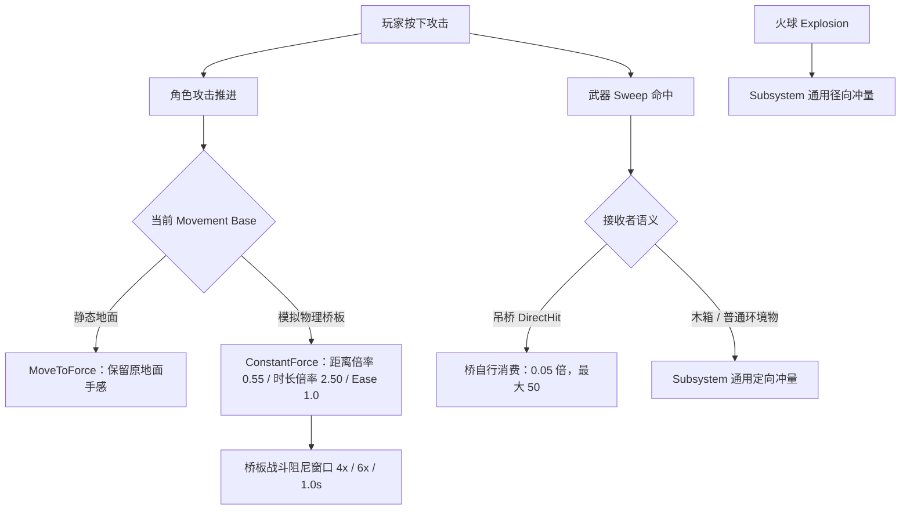

# 物理吊桥交互设计与验收说明

> 当前状态：60 板双侧约束结构、离桥恢复、攻击 / 落地反馈分层、共享配置权威与自动化门槛已完成
>
> 更新日期：2026-08-09
>
> 体验定位：开放区域中的动态通行节点，而不是独立展示的物理摆件
>
> 当前边界：机制与无头 PIE 通过；最终桥体美术、真实刀刃直击断言、爆炸压力与多桥性能仍待完成

## 0. 结论先行

这次吊桥迭代解决的不是“桥应该多软”这个单一调参问题，而是玩家行为如何被环境正确解读。

玩家在桥上攻击时仍保留前移，不会因为进入动态地面就失去招式手感；桥面也不会再把这段攻击推进误读成一次接近落地强度的冲击。最终专项结果为：

| 指标 | 修复前基线 | 当前结果 | 设计判断 |
|---|---:|---:|---|
| Attack01 最大桥体线速度 | `303.6cm/s` | `90.2cm/s` | 攻击仍可见，但不再主导整座桥 |
| Attack01 最大桥体角速度 | 未设硬门槛 | `206.0deg/s` | 低于 `280deg/s` 自动门槛 |
| 真实落地桥体线速度 | `300.2cm/s` | `309.3cm/s` | 落地保持更强反馈层级 |
| Attack / Landing 线速度比 | `1.011` | `0.292` | 通过 `<=0.75` 自动门槛 |
| 桥上攻击相对推进 | `25.8cm` | `18.3cm` | 通过 `>=15cm` 可读位移门槛 |
| 攻击额外脚步冲量 | 未设失败门槛 | `0` | 攻击推进不再伪装成脚步 |
| 攻击期间角色站立载荷 | `1.0` | `1.0` | 没有靠减轻角色重量掩盖抖动 |

核心方法是把四种不同语义的力拆开：

1. 角色在动态底座上的攻击推进；
2. 武器真实命中桥板的 DirectHit；
3. 武器命中木箱或普通刚体的通用冲量；
4. 火球爆炸产生的范围径向冲量。

它们可以由同一次玩家操作触发，但不能共用同一个强度旋钮。

## 1. 玩家体验目标

吊桥在开放区域中承担的是“动态路径”职责。它首先必须能稳定通行，其次才是晃动得好看。

### 1.1 体验承诺

玩家不需要学习新按键，只通过站立、走路、奔跑、起跳、落地、攻击和离开，就能读懂桥面的状态：

| 玩家行为 | 玩家应该看到的反馈 | 不允许出现的结果 |
|---|---|---|
| 站立 | 桥面持续承重并轻微下沉 | 周期性抽动、角色被弹起 |
| 行走 | 低强度、连续、可察觉的局部摆动 | 每一步都像落地 |
| 奔跑 | 明显强于行走，扰动传播范围更大 | 因频率过高而持续自激 |
| 起跳 | 离板瞬间有反作用 | 完全无反馈或单板弹飞 |
| 落地 | 成为最清楚的垂直冲击 | 被普通攻击盖过 |
| 攻击 | 保留角色推进和局部桥面响应 | 整座桥像被爆炸击中 |
| 离开 | 余振衰减，恢复自然弧线并休眠 | 永久歪斜或恢复驱动追着玩家 |

### 1.2 设计优先级

1. **稳定通行**：不穿透、不散架、不把角色弹飞；
2. **行为可读**：走、跑、跳、落地和攻击有清晰层级；
3. **控制权不丢失**：攻击方向、相机和角色位移仍由玩家输入决定；
4. **自然恢复**：无人接触后回到设计弧线，而不是强行锁成水平面；
5. **参数可归属**：每个体验问题都能找到唯一的调参入口；
6. **结果可回归**：体验指标进入自动失败门槛，而不只输出一行 `PIE_OK`。

## 2. 当前可玩结构

`BP_RopeBridge` 继承 `AWorldRopeBridge`。Construction 阶段根据配置自动生成桥板、桥墩和 Physics Constraint，运行时每块木板作为独立 Chaos 刚体参与承重和碰撞。

当前关卡演示实例：

- `60` 块独立物理木板；
- 单板 `400 x 25 x 6cm`，桥面约 `16.77m x 4.00m`；
- 单板 `15kg`，角色物理质量 `100kg`；
- 世界重力基线 `-980cm/s²`；
- 左右两端共 `4` 个桥墩和 `4` 个端点挂点；
- `59` 条板缝，每条板缝左右各一组约束；
- 总约束数 `2 x (N - 1) + 4`，当前为 `122`。

这组参数当前只以 `DA_WorldInteractionConfig.Settings.RopeBridge` 为权威。实机实例原有 `OverrideSettings` 的完整 `58` 字段已经复制到共享 Struct；`BP_RopeBridge` CDO 与关卡 Actor 都绑定该 DataAsset 并关闭 `Override Shared Settings`。旧 Override payload 保留用于审计，但不再参与 resolved settings。

```text
左端桥墩                  每道板缝均为左右双侧                  右端桥墩

Negative Y  o==[ ]==[ ]==[ ]== ... ==[ ]==[ ]==o  Negative Y
              |    |    |           |    |
Positive Y  o==[ ]==[ ]==[ ]== ... ==[ ]==[ ]==o  Positive Y
```

资产与工具入口：

| 类型 | 入口 |
|---|---|
| 蓝图 Actor | `/Game/PhysicsWorldDemo/Blueprints/BP_RopeBridge` |
| Runtime | `AWorldRopeBridge` |
| 世界共享配置 | `/Game/PhysicsWorldDemo/Config/DA_WorldInteractionConfig` |
| 角色移动配置（完整本地工程） | `/Game/Rover/Config/DA_RoverMovementConfig` |
| 桥 Actor 装配工具（完整本地工程） | `Scripts/ConfigurePhysicsWorldRopeBridge.ps1` |
| 定向稳定性调参 | `Scripts/ApplyRopeBridgeStabilityTuning.ps1` |
| 专项验证 | `Scripts/ValidatePhysicsWorldRopeBridgePIE.ps1` |

公开作品集仓库不包含第三方角色 `Content/Rover`、完整测试关卡和关卡 External Actor，因此不能把 clone 后直接运行装配脚本描述为完整复现。公开内容用于源码、共享配置资产、参数所有权、验证方法和设计证据审阅；`-SyncSharedConfigFromDemo` 必须在完整本地工程中配合显式 `SourceMapPath` 使用，不能自动猜测或公开迁移源地图。

## 3. 为什么宽桥使用双侧约束

### 3.1 中轴约束的问题

早期方案在每道板缝中轴只放一个关节。单块窄板时问题不明显，但桥面加宽到 `4m` 后，玩家踩在一侧会形成很大的横向力臂。长链求解误差沿桥传播，最终表现为：

- 中段木板绕前进轴横滚；
- 左右边缘高低差被逐板放大；
- 角色攻击或落地时出现麻花状扭转；
- 单纯收紧 Swing / Twist 会让桥越来越像硬板，仍不能提供真实的双侧支撑。

### 3.2 当前双侧方案

每道板缝建立两条不同职责的约束线：

| 约束线 | Linear | Angular | 设计职责 |
|---|---|---|---|
| 主约束（Negative Y） | X/Y/Z Locked | Swing1 Limited；其余按结构释放 | 保持链长并允许沿桥方向俯仰 |
| 稳定约束（Positive Y） | X/Y Locked；Z Free | 全部 Free | 用第二个受力点抑制横滚，不重复争夺完整姿态 |

两侧挂点位于：

```text
Y = +/-(PlankWidth / 2 - AnchorLateralInset)
```

当前木板宽 `400cm`、内缩 `15cm`，所以约束线位于 `Y=+/-185cm`。

副约束不能再复制一套完整锁定。两条完整约束同时要求同一刚体满足相同姿态，会造成过约束和高频抖动。当前方案用几何力臂稳定横滚，同时把冗余自由度释放给 Chaos 求解器。

## 4. 攻击抖动问题复盘

### 4.1 问题不是武器伤害数值

最早记录中，Attack01 桥体峰值为 `259.5cm/s`，而落地只有 `119.7cm/s`。随后通过保留落地前真实下降速度和增强落地传递，落地提高到 `300.2cm/s`，但攻击也达到 `303.6cm/s`，两者仍然接近持平。

专项诊断逐项排除了：

- 武器在峰值帧直接命中桥板；
- `UWorldInteractionSubsystem` 在攻击期间提交额外环境请求；
- Montage 动画 Root Motion；
- CharacterMovement 原生 Push Force；
- 吊桥周期 Movement Impulse；
- 单纯由角色站立重量突然增大造成的冲击。

峰值主要来自角色攻击推进在 Movement Base 上发生载荷转移，并经 60 板约束链延迟传播。它与“武器造成多少伤害”不是同一个问题。

### 4.2 为什么几个直觉方案不成立

| 尝试 | 为什么不作为最终方案 |
|---|---|
| 把桥整体阻尼拉高 | 走路、跑步、起跳和落地会一起变钝，失去动态路径价值 |
| 取消桥上攻击位移 | 能降低扰动，但直接破坏角色招式手感，不符合用户要求 |
| 攻击时降低角色重量 | 表面上更稳定，结束时却会产生卸载 / 重载回弹，物理语义也不真实 |
| 全局降低武器冲量 | 会同时削弱一刀破箱和普通刚体反馈，跨系统串扰 |
| 只关闭 Push Force | 可以排除一条能量来源，但无法解决 Root Motion 推进跨板产生的载荷转移 |
| 结束攻击时清空全部速度 | 会连真实负 Z 下落速度一起清掉，板缝处可能悬停后再次压桥 |

最终方案必须同时保住三件事：攻击仍前移、角色重量不变、落地仍明显强于攻击。

## 5. 最终反馈分流



### 5.1 动态底座攻击推进

静态地面仍使用原有 `MoveToForce`，避免这次吊桥修复改变所有地面攻击手感。只有角色站在模拟物理底座上时，攻击推进切换为平滑 `ConstantForce` Root Motion Source：

| 参数 | 当前值 | 含义 |
|---|---:|---|
| `AttackAdvanceScaleOnSimulatedBase` | `0.55` | 保留原攻击推进距离的 55% |
| `AttackAdvanceDurationScaleOnSimulatedBase` | `2.50` | 将动态底座推进摊到更长时间，降低载荷尖峰 |
| `AttackAdvanceEaseOnSimulatedBase` | `1.0` | 使用完整平滑起停曲线，同时归一化总位移 |

当前测试中，角色相对脚下桥板前移 `18.3cm`，最大水平推进速度约 `47.3cm/s`。这段位移是明确保留的玩法表现，不属于异常冲量。

Root Motion Source 额外设置：

- `IgnoreZAccumulate`：攻击推进只负责水平位移，不覆盖重力和真实下落；
- 结束时 `ClampVelocity=0`：清理推进产生的水平残速；
- 若攻击从静态地面开始、过程中踏上模拟桥板，会在 Movement Base 改变时立即启用物理推力隔离。

### 5.2 角色载荷保持真实

动态底座攻击期间：

| 参数 | 当前值 | 设计理由 |
|---|---:|---|
| `AttackPhysicsPushScaleOnSimulatedBase` | `0.0` | 关闭 CharacterMovement 原生碰撞推力，避免额外尖峰 |
| `AttackStandingDownwardForceScaleOnSimulatedBase` | `1.0` | 保留完整站立重量，避免卸载 / 回弹 |
| `bSuppressRootMotionMovementImpulses` | `true` | 不把攻击推进识别为周期脚步 |
| `RootMotionMovementImpulseSuppressionGraceTime` | `0.60s` | 防止跨板后的残余速度马上被当成脚步 |

这里的设计原则是：移除错误的“冲击来源”，而不是移除角色真实重量。

### 5.3 桥板战斗响应阻尼窗口

角色攻击推进作用于桥面时，吊桥临时提高自身刚体阻尼：

| 参数 | 当前值 | 作用 |
|---|---:|---|
| `AttackResponseLinearDampingMultiplier` | `4.0` | 降低攻击推进带来的整链线速度峰值 |
| `AttackResponseAngularDampingMultiplier` | `6.0` | 更强地抑制宽桥横滚和局部扭转 |
| `AttackResponseDampingGraceTime` | `1.0s` | 覆盖推进结束后仍在约束链中传播的延迟响应 |

窗口只在桥上攻击推进及其余量期生效。普通站立、走路、跑步、起跳和落地仍使用基础 `LinearDamping / AngularDamping`，因此没有把整座桥永久调硬。

### 5.4 武器 DirectHit 由桥自行消费

`AWorldRopeBridge` 实现 `UPhysicsInteractable`。当 DirectHit 的命中组件确实是模拟中的桥板时：

1. 桥识别命中木板；
2. 使用 `Request.ImpulseStrength * DirectHitImpulseScale` 计算冲量；
3. 用 `MaximumDirectHitImpulse` 限制约束链的单次输入；
4. 在命中位置调用 `AddImpulseAtLocation`；
5. 告知 `UWorldInteractionSubsystem` 该接收者已经自行处理刚体冲量；
6. Subsystem 跳过对同一桥 Actor 的通用冲量，避免重复施力。

当前参数：

- `DirectHitImpulseScale = 0.05`；
- `MaximumDirectHitImpulse = 50`。

这组值只属于吊桥。木箱的一刀破裂、普通刚体的定向反馈和伤害数值没有被同步削弱。

> 当前自动化验证了 DirectHit 参数、接口分流和实现链存在，但尚未模拟真实刀刃命中桥板并断言最终冲量。因此这里不能写成“真实直击行为已经完整自动验收”。

### 5.5 Explosion 保持独立

Explosion 仍由 `UWorldInteractionSubsystem` 走通用径向冲量。它不复用吊桥 DirectHit 的 `0.05 / 50` 限制，也不修改木箱爆炸参数。

这是刻意保留的语义差异：

- 普通攻击：局部、定向、低桥体能量；
- 落地：以角色下坠速度为依据的主要垂直冲击；
- 爆炸：范围事件，后续单独做桥体稳定与极端参数保护。

## 6. 走、跑、跳、落地与恢复

### 6.1 站立与移动

角色站立使用 CharacterMovement 的持续向下载荷，不循环注入脉冲。水平移动达到最低速度后，吊桥按速度映射周期生成向下脚步冲量：

- 行走和奔跑共用一条速度曲线；
- 强度按速度而不是动画状态计算；
- Root Motion 攻击推进被排除；
- 同一帧只记录可解释的输入来源。

最新实测输入冲量为 `46.9 / 123.4`，奔跑显著高于行走。

### 6.2 起跳与落地

起跳只有在 `JumpCurrentCount` 确认真正离板后才注入反作用，避免普通板缝抖动被误判为跳跃。落地使用接触前记录的最大负 Z 速度，不依赖落地帧已经被 CharacterMovement 清零后的速度。

起跳和落地冲量按以下权重分给脚下板及前后相邻板：

```text
前一块 0.2  +  当前块 0.6  +  后一块 0.2
```

有效木板数量不足时会重新归一化。这样既扩大了可见受力范围，也避免把完整冲量集中到一块板上造成弹飞或横滚。

### 6.3 离桥恢复

恢复不是持续运行的姿态锁。只有所有交互角色离开桥面后才会启动：

1. 等待 `UnloadedRecoveryDelay`，避开刚离板的碰撞尾部；
2. 在 `UnloadedRecoveryBlendInTime` 内渐入角向恢复；
3. 每块板朝 Construction 阶段记录的自然弧线旋转；
4. 同时使用角速度阻尼耗散余振；
5. 进入角误差和角速度容差后停止驱动并允许 Chaos Sleep。

当前离桥 10 秒结果为 `0.0cm/s / 0.0deg/s`，自然姿态误差 `1.13deg`。

## 7. 当前演示实例参数

以下数值描述已经写入共享 `DA_WorldInteractionConfig` 并由关卡实例验证的 60 板配置。当前 Blueprint CDO 和实例都禁止 Override，以共享 DataAsset 优先于 C++ 默认值。

### 7.1 结构与稳定性

| 体验维度 | 参数 | 当前值 |
|---|---|---:|
| 桥面规模 | Plank Count / Size / Gap | `60 / 400 x 25 x 6cm / 3cm` |
| 初始轮廓 | Bridge Sag | `80cm` |
| 左右挂点 | Anchor Lateral Inset | `15cm`，得到 `Y=+/-185cm` |
| 单板重量 | Plank Mass | `15kg` |
| 基础自然衰减 | Linear / Angular Damping | `1.5 / 4.0` |
| 前后摆幅 | Swing1 Limit | `14deg` |
| 旧中轴模式兼容值 | Swing2 Limit | `0.8deg`；当前双侧模式将 Swing2 / Twist 设为 Free，此值不参与求解 |
| 长链求解 | Position / Velocity Iterations | `32 / 8` |
| 碰撞稳定 | Mass Conditioning / CCD | 开启 / 开启 |

### 7.2 行为输入

| 体验维度 | 参数 | 当前值 |
|---|---|---:|
| 脚步强度 | Reference Impulse / Interval | `180 / 0.16s` |
| 起跳识别 | Minimum Speed / Scale | `120cm/s / 0.004` |
| 起跳冲量 | Minimum / Maximum | 当前实例均为 `10000` |
| 落地识别 | Minimum Speed / Scale | `180cm/s / 0.014` |
| 落地冲量 | Minimum / Maximum | 当前实例均为 `20000` |
| 冲量分摊 | Center / Adjacent / Adjacent | `0.6 / 0.2 / 0.2` |
| 角色追踪高度 | Character Tracking Height | `450cm` |

起跳 / 落地下限与上限当前收敛为固定高值，是演示实例的阶段参数，不是最终通用设计。后续需要重新打开速度映射，让普通跳、二段跳和高处落地形成更细的层级。

### 7.3 攻击与恢复

| 体验维度 | 参数 | 当前值 |
|---|---|---:|
| 桥上推进 | Distance Scale / Duration Scale / Ease | `0.55 / 2.50 / 1.0` |
| 原生 Push / 站立载荷 | Scale / Scale | `0.0 / 1.0` |
| DirectHit | Scale / Maximum | `0.05 / 50` |
| 战斗阻尼 | Linear / Angular / Grace | `4.0x / 6.0x / 1.0s` |
| 离桥恢复 | Delay / Blend In | `0.5s / 1.0s` |
| 恢复驱动 | Stiffness / Damping | `1200 / 75` |
| 休眠条件 | Rest Error / Angular Speed | `2deg / 5deg/s` |

## 8. 策划调参入口与方法

### 8.1 在哪里改

当前项目统一修改所有桥的共享值：

```text
DA_WorldInteractionConfig
  -> Settings
  -> Rope Bridge
```

修改后重新运行 Construction 或调用 `Rebuild Bridge`。不要为了单桥手感重新勾选 `Override Shared Settings`；这会再次产生关卡实例与共享配置分叉。确实需要多套桥型时，应建立明确命名的配置资产 / Profile，并让桥显式引用，而不是把匿名 Override 当成长久权威。

修改角色在动态底座上的攻击推进（完整本地工程 DataAsset）：

```text
DA_RoverMovementConfig
  -> Settings
  -> Combat
  -> Dynamic Base
```

应用当前定向稳定性基线：

```powershell
powershell -File Scripts/ApplyRopeBridgeStabilityTuning.ps1
```

该脚本现在写入共享 `DA_WorldInteractionConfig`，同时确保 Blueprint CDO 与实例关闭 Override。它只修改列出的攻击隔离、恢复和稳定性参数，并保留木板数量、宽度、下垂、Swing1、脚步冲量等手调值。

只有需要把既有实机实例一次性迁回共享配置时，才在完整本地工程执行：

```powershell
powershell -File Scripts/ConfigurePhysicsWorldRopeBridge.ps1 `
  -EngineRoot <UE5.8-path> `
  -SyncSharedConfigFromDemo `
  -SourceMapPath "/Game/ThirdPerson/Lvl_ThirdPerson"
```

工具要求源地图路径显式传入，且 tagged bridge 必须确实启用 Override；同步成功后会逐 Struct 校验、关闭 CDO / Actor Override，再保存共享 DataAsset、Blueprint 和源地图。该源地图不包含在公开仓库。

### 8.2 按玩家感受调

| 想改变的体验 | 首选参数 | 增大后的结果 | 风险与联动 |
|---|---|---|---|
| 桥更长 | `PlankCount`、`PlankDepth`、`PlankGap` | 桥墩间距增加 | 约束数和求解成本同步增加 |
| 桥更宽 | `PlankWidth` | 横向通行空间增加 | 必须检查双侧挂点间距和横滚 |
| 桥更有弧度 | `BridgeSag` | 中部初始位置更低 | 过大会导致端板角度过陡或穿插 |
| 桥整体更沉 | `PlankMassKg` | 相同冲量下加速度更小 | 角色站立下沉与约束负载也会改变 |
| 走跑更明显 | `MovementImpulseAtReferenceSpeed` | 脚步反馈增强 | 不要用缩短 Interval 代替强度 |
| 跑步与走路差更大 | `MovementReferenceSpeed` 与强度曲线 | 高速段差异拉开 | 必须用桥体速度验证，不只看输入值 |
| 起跳蹬板更明显 | Jump Scale / Min / Max | 离板反作用增强 | 过高会让不同跳跃都撞到下限 |
| 落地更重 | Landing Scale / Min / Max | 垂直冲击增强 | 必须保持约束稳定并高于攻击 |
| 攻击前移更多 | `AttackAdvanceScaleOnSimulatedBase` | 桥上攻击距离增加 | 会同步提高载荷转移 |
| 攻击更柔和 | Duration Scale、Ease | 同距离下峰值更低 | Duration 过长会拖慢招式响应 |
| 攻击让桥再稳一些 | Combat Damping Multipliers | 战斗窗口内衰减更快 | 只调桥侧窗口，不要提高全局阻尼 |
| 刀刃直击更明显 | DirectHit Scale / Maximum | 命中板局部响应增强 | 不影响木箱；需补真实直击回归 |
| 离开后更快回正 | Recovery Stiffness / Damping | 更快回到自然弧线 | 只允许无人接触时运行 |
| 中段减少横滚 | 扩大双侧挂点间距、提高 Solver | 横向稳定增强 | 不要叠加第二套完整锁定 |
| 板缝减少拉开 | Position Iterations / Linear Projection | 长链误差降低 | Projection 过强会出现硬拉和抖动 |

### 8.3 不建议联动的参数

- 不要为了压攻击抖动降低角色质量或站立载荷；
- 不要为了保住木箱手感而提高吊桥 DirectHit；
- 不要让 Explosion 复用普通攻击的桥板上限；
- 不要用全局 `AngularDamping` 解决只发生在攻击窗口的问题；
- 当前双侧模式中 `Swing2 / Twist` 为 Free，不要用这两个旧中轴参数调横滚；应调整双挂点几何间距和 Solver；
- 不要只比较“输入冲量”判断手感，必须比较桥体实际线速度、角速度和恢复结果。

## 9. 自动化验收

### 9.1 为什么测试两次 Attack01

Chaos 长链会受初次资产加载、帧时间和约束初态影响。专项不是只取一次好看的结果，而是：

1. 等桥体进入安静状态；
2. 执行第一次 Attack01；
3. 等连击与桥体恢复；
4. 再执行一次 Attack01；
5. 两次结果取最大线速度和最大角速度；
6. 再与真实跳跃落地峰值比较。

### 9.2 当前硬门槛

| 自动失败条件 | 门槛 |
|---|---:|
| Attack / Landing 最大线速度比 | `<=0.75` |
| Attack 最大角速度 | `<=280deg/s` |
| 桥上相对前向推进 | `>=15cm` |
| 攻击额外桥体 Movement Impulse | `<=0.01` |
| 战斗阻尼窗口 | 必须在推进期间启用，并在 Grace 后恢复 |
| CharacterMovement Push | 必须按动态底座配置隔离 |
| 攻击站立载荷 | 必须保持配置后的完整 `1.0` |
| 离桥 10 秒线 / 角速度 | `0 / 0` |
| 自然姿态最大角误差 | `<=2deg` |
| 中心最大附加下沉 | `<=75cm` |

### 9.3 最新无头 PIE 证据

来源：`PhysicsWorld-RopeBridge-PIE-20260809-191258-34672.log`。

| 验证项 | 最新结果 | 判断 |
|---|---:|---|
| 结构 | `60` 板 / `122` 约束 / `4` 支点 | 通过 |
| 配置权威 | Actor / Blueprint CDO Override 均为 `false`，resolved settings 等于共享 DataAsset | 通过 |
| 双侧板缝 | `59` 对，横向误差 `0.000cm` | 通过 |
| 质量 | 单板 `15kg` / 角色 `100kg` / 站立载荷 `1.00` | 通过 |
| 站立桥体峰值 | `108.0cm/s / 61.9deg/s` | 作为对照记录 |
| 第一次 Attack01 | `43.9cm/s / 72.9deg/s` | 通过 |
| 第二次 Attack01 | `90.2cm/s / 206.0deg/s` | 通过 |
| 两次攻击最大值 | `90.2cm/s / 206.0deg/s` | 通过阈值 |
| 攻击相对前移 | `18.3cm` | 通过 `>=15cm` |
| 攻击额外 Movement Impulse | `0.00` | 通过 |
| 攻击 World Interaction | `0` | 本轮没有刀刃直击桥板 |
| 行走 / 奔跑输入 | `46.9 / 123.4` | 速度层级成立 |
| 起跳 / 落地输入 | `10000 / 20000` | 输入层级成立 |
| 真实落地桥体峰值 | `309.3cm/s` | 落地反馈强度层级成立 |
| Attack / Landing | `0.292` | 通过 `<=0.75` |
| 中心最大附加下沉 | `18.5cm` | 通过 |
| 离桥 10 秒速度 | `0.0cm/s / 0.0deg/s` | 通过 |
| 自然姿态误差 | `1.13deg` | 通过 |
| 端点 / 板间误差 | `0.62cm / 0.99cm` | 通过 |

本轮完整回归：

| 脚本 | 结果 |
|---|---|
| `Scripts/BuildEditor.ps1` | UE 5.8 Development Editor 编译通过并同步 DLL |
| `Scripts/ValidatePhysicsWorldRopeBridgePIE.ps1` | 结构、载荷、攻击分层、落地与恢复通过 |
| `Scripts/ValidateRoverPIE.ps1` | GameMode、Pawn、输入、移动与跳跃冒烟通过 |

## 10. 当前边界与下一步

当前可以对外准确表达为：

> 60 板动态吊桥已经完成结构、承重、离桥恢复、共享配置权威和“攻击低于落地”的自动化反馈分层。攻击保留 `18.3cm` 相对推进，最大桥体线速度为落地的 `29.2%`。

仍不能宣称：

- 所有武器直击桥板角度都已自动验收；
- 火球爆炸作用于吊桥已经完成稳定性压力测试；
- 多座 60 板桥同时运行已经达到开放区域性能预算；
- 当前 Box / Cylinder 结构已经达到最终美术质量；
- 接收者自处理冲量已经纳入通用 `PhysicsBodyCount`；当前桥板通过 `ReceiverCount` 可见，通用刚体计数仍只覆盖 Subsystem 施力分支；
- 单次无头 PIE 可以替代有渲染手感和镜头观察。

下一轮按以下顺序推进：

1. 在专项中加入真实刀刃命中桥板，断言只执行桥自管 DirectHit、最终冲量受上限控制，并补齐自处理刚体的结果计数语义；
2. 增加 Explosion 对桥面、桥墩和多块板同时作用的稳定性测试；
3. 记录同一硬件下 1 / 3 / 5 座 60 板桥的 Chaos Game / Physics 帧时间与休眠比例；
4. 用正式木板、绳索 / 护栏、材质和声音替换机制占位资产；
5. 以固定路线录制走、跑、跳、落地、攻击和离桥恢复的有渲染对比。

## 11. 演示与面试讲解

### 11.1 现场演示顺序

1. 从桥外静止镜头展示自然下垂和四个挂点；
2. 走上桥，停在中部，让观众看到持续承重；
3. 同一路线先走再跑，展示速度层级；
4. 在桥中部起跳并落地，展示明显强于普通攻击的落地反馈；
5. 在桥上攻击，展示角色仍前移但桥没有出现落地级震荡；
6. 离桥后保持镜头，展示余振衰减、姿态恢复和休眠；
7. 最后打开调试或展示自动化结果，用 `0.292` 比值和共享 Struct 一致性说明体验门槛与参数权威。

### 11.2 60 秒讲法

> 我把吊桥当成开放区域的动态通行节点，而不是一个单独的 Physics Constraint 样例。结构上，60 块宽木板使用每道板缝左右双约束和四个端点挂点，解决中轴约束造成的横滚扭曲；交互上，站立、走跑、起跳、落地和攻击都使用现有玩家行为驱动。
>
> 最大的问题是桥上攻击既要保留位移，又不能比落地更晃。我没有取消位移或降低角色重量，而是把动态底座推进、武器直击桥板、木箱通用冲量和爆炸径向冲量拆成独立通道。桥上推进改成平滑 ConstantForce，并增加只在战斗窗口生效的桥板阻尼；桥板 DirectHit 由接收者自行限幅，木箱和爆炸参数保持独立。最终攻击仍前移 18.3cm，桥体峰值降到落地的 29.2%。我还把关卡 Override 的完整 58 字段迁回共享 DataAsset，让 CDO、实例和专项验证读取同一套参数。

### 11.3 这项工作体现的能力

- 从玩家行为定义环境反馈层级，而不是先堆技术功能；
- 识别同一次输入中的不同物理语义，并建立参数所有权；
- 在保留角色手感的前提下解决动态底座能量串扰；
- 把“看起来没那么抖”转成可重复的线速度、角速度、位移比和恢复门槛；
- 明确机制原型、视觉验收和开放区域规模证据之间的边界。

## 12. 关联文档

- `Docs/InteractionDesignLog-2026-08-09-RopeBridgeAttackResponse.zh-CN.md`：本轮攻击响应分层的过程复盘；
- `Docs/InteractionDesignLog-2026-08-07.zh-CN.md`：双侧约束与离桥恢复的原始迭代记录；
- `Docs/Roadmap.zh-CN.md`：公开作品集阶段路线。
