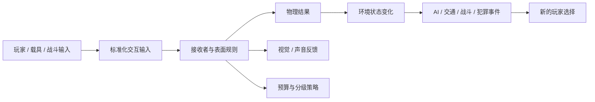
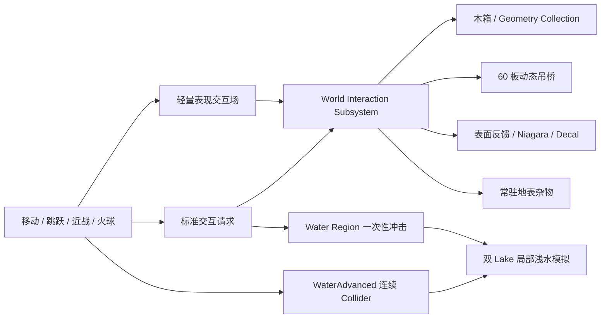

# UE5 开放区域物理交互 Demo｜从世界规则到可验证垂直切片

这是一个基于 Unreal Engine 5.8 的第三人称开放区域物理交互 Demo。现有角色移动与战斗作为玩家输入载体，近战、火球、移动、跳跃和落地通过统一的交互语言驱动 Chaos、Niagara、Physical Material、Decal、Physics Constraint 与 WaterAdvanced。

项目不是为了罗列“做过哪些物理效果”，而是回答四个问题：

1. 为什么开放世界需要物理交互；
2. 物理交互策划应该定义什么；
3. 交互规则如何组织、生产和分级；
4. 如何用一个可玩 Demo 和可复现数据证明这些规则成立。

| 项目项 | 当前定位 |
|---|---|
| 作品集方向 | 大世界物理与环境交互策划 / 技术美术（物理方向） |
| 当前场景 | 营地垂直切片：5 个木箱、60 板吊桥、常驻轻质杂物区、2 个可交互 Lake |
| 我的职责 | 交互规则、协议与反馈分级，C++ / Chaos / Niagara 实现，资产工具和自动化验收 |
| 技术基线 | UE 5.8、Chaos、Geometry Collection、Niagara、Physical Material、Physics Constraint、WaterAdvanced、Editor Scripting、无头 PIE |

> 当前作品证明的是开放区域垂直切片中的规则、实现、资产接入、调参与验证闭环。它不以 100m 级营地直接宣称完成“大世界性能验证”；World Partition / HLOD、多区域流送、固定硬件 p50/p95、多人权威和正式美术仍属于后续工作。

---

## 1. 为什么想做物理交互

我本科阶段学习游戏设计时，最受《塞尔达》影响的不是某个单独功能，而是它让玩家组合世界规则：金属能够导电、火焰能够改变环境、物体的材质与状态会影响后续行为。系统没有为每种玩家故事单独编写脚本，却能通过一致规则产生可理解、可利用的结果。

GTA-like 开放世界的题材不同，但面临相似的问题。玩家会在任务之外驾驶、碰撞、破坏和制造爆炸。一次交互如果只产生位移和特效，很快就会成为一次性表现；如果结果能够继续影响环境状态、NPC、交通、犯罪或战斗，它才会形成真正的沙盒事件。

因此，我想研究的不是“怎样让更多物体被撞飞”，而是：

> **如何把物理能力转成玩家可以感知、预测、利用和组合的世界规则，并让这些规则能够被内容团队稳定生产、分级表现和持续验证。**

这个目标同时要求 Gameplay 设计、必要的物理技术理解、资产生产意识和性能边界判断。当前 Demo 是我对这套工作方式的垂直切片验证。

---

## 2. 怎么定义物理交互策划

我理解的物理交互策划，不是单纯研究物理模拟，也不是只提出“这里要有破坏效果”，而是：

> **设计玩家可以理解、预测和利用的世界行为规则，并把规则转成跨系统可执行的参数、资产要求、分级方案和验收标准。**

这个岗位需要同时回答四类问题：

| 职责 | 需要回答的问题 | 典型交付物 |
|---|---|---|
| 体验与规则 | 玩家做了什么，世界为什么这样回应，结果是否可预测、可组合？ | 交互矩阵、阈值、状态、反馈层级 |
| 系统联动 | 物理结果如何继续影响战斗、AI、交通、犯罪或关卡？ | 事件协议、模块边界、上下游需求 |
| 资产生产 | 特效、贴花、碰撞体、物理材质和破坏资产怎样低成本复用？ | 资产规范、配置模板、生成/校验工具 |
| 性能与验证 | 哪些对象需要真实模拟，哪些可以降级，怎样证明效果和成本成立？ | 质量等级、预算、调试统计、自动化与试玩标准 |

策划与程序、美术的关系不是“策划决定、下游执行”。我的工作方式是：策划负责玩家侧目标、规则和可比较的成功标准；程序、美术、关卡与策划共同收敛实现、生产方式和预算，技术约束再反向修正规则。

---

## 3. 交互规则如何组织

### 3.1 从六个字段定义一条规则

一条环境交互规则不能只写“载具可以撞坏消防栓”。至少需要定义六个字段：

| 字段 | 要回答的问题 | 示例 |
|---|---|---|
| Source | 谁产生输入？ | 玩家、载具、武器、爆炸、火、水、风 |
| Input | 输入的物理与玩法语义是什么？ | 速度、冲量、方向、半径、温度、持续时间 |
| Receiver | 谁接收，表面或对象类型是什么？ | NPC、载具、刚体、可破坏物、Wood、Water |
| Threshold | 多大输入开始响应，如何分级？ | 轻撞、重撞、高速撞击；可破坏/不可破坏 |
| Response | 产生什么即时与后续结果？ | 位移、破坏、状态变化、视听反馈、AI 事件 |
| Budget / Fallback | 数量、距离或平台变化时如何降级？ | 真实刚体→预制状态→纯表现→静态结果 |

规则链路如下：



不是每个对象都需要跑到事件链末端，但同类输入和同类对象应使用一致语言。

### 3.2 把反馈分成不同成本和权威等级

| 层级 | 作用 | 当前 Demo 示例 |
|---|---|---|
| Gameplay 物理 | 影响通行、伤害、破坏或玩家决策，需要稳定语义 | 木箱刚体与 GC 破坏、动态吊桥 |
| Gameplay 状态 | 保存对象是否损坏、燃烧、可通行等逻辑状态 | 木箱生命与破坏状态 |
| 表现物理 | 放大速度、方向和冲击，不承担阻挡与网络权威 | Niagara 落叶/纸片、水面扰动、灼烧贴花生命周期 |
| 下游事件 | 把局部结果传给其他 Gameplay 系统 | 当前协议预留；NPC/交通/犯罪尚未实现 |

开放世界不能让所有对象都使用最高成本方案。对象是否进入真实刚体或 Chaos 破坏，应根据玩家关注度、Gameplay 价值、交互频率、距离、平台预算和网络权威决定。

### 3.3 用协议隔离来源和响应

当前工程使用两类通用输入，并为插件原生的持续接触保留专用路径：

| 通道 | 职责 | 当前消费者 |
|---|---|---|
| `FWorldInteractionRequest` | 命中、伤害、冲量、范围和表面识别等标准 Gameplay 交互 | 木箱、Geometry Collection、吊桥、表面反馈、贴花 |
| `FWorldLightweightInteractionField` | 不进入 Gameplay 权威判定的轻量表现扰动 | 常驻 Niagara 落叶与纸片 |
| WaterAdvanced 连续 Collider | 角色身体与水面的持续接触 | 两个 Lake 的局部 Grid2D 浅水模拟 |

`UWorldInteractionSubsystem` 负责请求校验、空间分发、表面解析、共享生命周期和调试统计；环境对象通过 `UPhysicsInteractable` 决定自身如何响应。角色和战斗组件不直接持有木箱、吊桥、贴花或 Niagara 的引用。

当新需求的语义适合现有协议时，输入侧不需要依赖新的环境类；但新增交互仍需要补齐来源映射、接收规则、配置、资产和测试，并不是“只加一个枚举值”即可完成。

### 3.4 当前已接通的规则矩阵

| 来源 \ 响应 | 刚体 / GC | 吊桥 | 常驻杂物 | WaterAdvanced | Decal / 表面 |
|---|---:|---:|---:|---:|---:|
| 移动 | — | 走/跑承重 | 已接通 | 连续身体 Collider | — |
| 跳跃 / 落地 | — | 分层冲击 | 已接通 | 一次性冲击 | — |
| 近战 | 木箱直击破坏 | 局部 DirectHit | 空挥也扰动 | 定向冲击 | Wood / Water |
| 火球爆炸 | 多对象范围响应 | 通用 Explosion 路径 | 径向扰动 | 范围冲击 | 灼烧贴花、表面解析 |
| Wind | P1 | P1 | 协议已预留 | P1 | — |

Wood 链路当前最完整；Stone、Metal、Grass、Water、Cloth 已有部分表面或协议槽位，但差异化反馈尚未全部完成。

---

## 4. 已有 Demo

### 4.1 一句话架构

> **玩家沿用已经掌握的移动和战斗操作产生标准化输入；环境按照自身类型、表面和成本等级响应；关键策划参数有明确所有权，协议、资产状态和体验阈值通过专项脚本回归。**



### 4.2 火球、木箱与资产生产管线

近战与火球共享环境交互协议：近战强调刀身 Sweep 的时机和方向，火球命中后只提交一次 Explosion 请求，范围内对象根据自身规则分别破裂、受冲量或忽略。

- 木箱完整态为开启刚体模拟的 Static Mesh，破裂时把 Transform、线速度和角速度交给 16 碎片 Geometry Collection；
- Physical Material / Surface Type 用于解析 Wood 表面并选择反馈；
- `OnChaosBreakEvent` 只在真实破裂后触发木屑 Niagara；
- 爆炸、投射物、碎片和灼烧贴花均有数量或时间上限；
- Fracture 资产内部面从 `245,992` 降到 `412`，资产从 `22.1MB` 降到 `168KB`，16 个碎片、根簇和凸包结构不变。

这个案例同时对应交互框架、特效/贴花/物理材质生产管线和资产成本控制。

### 4.3 60 板动态吊桥：把“不要太抖”转成体验门槛

吊桥由 `60` 块独立物理木板、`122` 个约束和 `4` 个端点挂点组成。最大问题是攻击 Root Motion、CharacterMovement 推力、武器 DirectHit 与约束响应叠加后，普通挥刀接近跳跃落地的震荡强度。

处理方式不是降低角色重量或把整座桥永久调硬，而是拆分四种语义：动态底座推进、武器 DirectHit、木箱通用冲量和 Explosion 径向冲量。攻击推进改成平滑施力，桥侧只在战斗窗口提高阻尼，DirectHit 由吊桥接收者自行限幅。

| 验收项 | 当前结果 |
|---|---:|
| 攻击相对脚下桥板推进 | `18.7cm` |
| Attack 最大桥体线速度 | `158.8cm/s` |
| Landing 最大桥体线速度 | `309.2cm/s` |
| Attack / Landing | `0.514`，通过 `<=0.75` 门槛 |
| 离桥 10 秒速度 | `0.0cm/s / 0.0deg/s` |
| 自然姿态误差 | `1.13deg` |

完整说明见 [物理吊桥系统说明](./Docs/物理吊桥系统说明.md)。真实刀刃 DirectHit、Explosion 压力、多桥性能和最终美术仍待正式验收。

### 4.4 常驻地表轻质杂物：环境先于玩家存在

初版把移动、攻击、落地和爆炸分别做成 Niagara Burst。虽然能看到反馈，但每次操作都重新生成一批粒子，语义更像“角色技能特效”，不是“环境中的落叶被玩家扰动”。

当前规则改为：一个 Region 维持约 `450` 个 Ambient 粒子的稳态预算，交互只扰动已经存在的粒子，不为每次输入创建新的 Niagara System。

- 移动、攻击、起跳、落地与爆炸具有独立方向、范围和强度；
- 攻击使用地面释放力与刀路前方吸引力形成短尾流；
- 每个来源有每帧预算和丢弃计数，武器 Trace 精度不会等比例放大 Niagara 成本；
- 轻量场不进入木箱和吊桥的 Chaos 请求链，专项验证结果为 `interaction_systems=0`；
- 无头 PIE 证明协议、方向、限流和生命周期，但不代替最终像素与手感验收。

完整复盘见 [Niagara 常驻地表杂物交互日志](./Docs/InteractionDesignLog-2026-08-09.zh-CN.md)。

### 4.5 双 Lake 浅水交互：持续接触与离散事件分层

Demo 保留关卡中已有的两个 `WaterBodyLake`。每个 Lake 使用一个 Region 做空间过滤，并共享玩家附近的 WaterAdvanced Grid2D 局部浅水模拟。

- 行走和奔跑由 `PHYS_Rover_Male` 的 `14` 个主要身体 Collider 提供连续输入；
- 起跳、落地、近战和爆炸通过一次性位置、速度、半径与强度输入水面；
- 资产绑定、Body 数量、运行时标签和跨 Lake 过滤均进入专项验证；
- 当前窗口约为 `2400cm / 512`，只证明局部交互，不代表远距离大水域方案。

完整复盘见 [WaterAdvanced 双湖交互设计日志](./Docs/InteractionDesignLog-2026-08-10-WaterAdvanced.zh-CN.md)。游泳、浮力、湿身、元素反应与正式 GPU 性能仍未完成。

---

## 5. 验证方法与当前边界

### 5.1 三层验收

| 验收层 | 证明什么 | 不能证明什么 |
|---|---|---|
| 协议与资产自动化 | 请求、接收者、去重、生命周期、资产引用和配置状态正确 | 最终画面是否自然、手感是否舒服 |
| 量化 PIE | 位移、速度、角速度、数量、比值和恢复时间满足门槛 | 大规模同屏或所有平台性能 |
| 有渲染试玩 | 力度、方向、节奏、镜头和视觉可读性 | 固定硬件长期 p50/p95 |

所有 C++ 修改通过固定脚本构建，再由 `UnrealEditor-Cmd -ExecutePythonScript` 运行专项无头 PIE。关键的策划可调参数进入 Config / DataAsset；安全保护和底层实现细节仍由代码负责。

### 5.2 当前不能对外宣称的内容

- 尚无固定硬件、固定路线下的 Game / Render / GPU p50、p95 和内存报告；
- 尚未完成多 Region、多桥、World Partition Cell、HLOD 和 LWC 远原点压力验证；
- 当前 Niagara、木箱材质和灼烧贴花仍是 P0 视觉质量；
- 全局风、Chaos Cloth、草地 WPO、火/风/水组合反应仍在后续阶段；
- 当前没有 NPC、交通、犯罪链、多人网络权威和长期世界持久化实现。

最新阶段规划见 [Roadmap](./Docs/Roadmap.zh-CN.md) 与 [大世界物理交互 Demo 开发规划](./Docs/大世界物理交互Demo开发规划.md)。

---

## 6. 操作方式

| 输入 | 功能 |
|---|---|
| `WASD` | 移动并影响吊桥、地表杂物与浅水 |
| `Left Shift` | 奔跑，反馈强于行走 |
| `Space` | 跳跃 / 二段跳，起跳与落地使用独立反馈 |
| 鼠标左键 | 近战；刀锋有效帧影响木箱、吊桥、杂物与水面 |
| `WASD + 攻击` | 每段重新选择攻击方向 |
| `Q` | 发射火球并产生范围爆炸 |

调试入口：

- `pw.LooseDebris.DrawFields 0/1`：轻量交互场；
- `rover.combat.DrawAttackTrace 0/1`：武器 Sweep。

---

## 7. 文档索引

- [项目介绍与阶段总结](./Docs/开放区域物理交互Demo_项目介绍与阶段总结.md)
- [大世界物理交互 Demo 开发规划](./Docs/大世界物理交互Demo开发规划.md)
- [吊桥攻击响应分层复盘](./Docs/InteractionDesignLog-2026-08-09-RopeBridgeAttackResponse.zh-CN.md)
- [物理吊桥系统说明](./Docs/物理吊桥系统说明.md)
- [Niagara 常驻地表杂物交互复盘](./Docs/InteractionDesignLog-2026-08-09.zh-CN.md)
- [Niagara 地表轻质杂物系统方案](./Docs/Niagara地表轻质杂物交互系统方案.md)
- [WaterAdvanced 双湖浅水交互复盘](./Docs/InteractionDesignLog-2026-08-10-WaterAdvanced.zh-CN.md)
- [鸣潮水面复刻实现方案](./Docs/鸣潮水面复刻实现方案.md)

<details>
<summary><strong>构建与验证</strong></summary>

要求：Windows 10 / 11、Unreal Engine 5.8、Visual Studio 2022、Git LFS。

```powershell
git lfs install
git clone https://github.com/GoodNatGod/UE5-Physics-Interaction-Demo.git
cd UE5-Physics-Interaction-Demo

powershell -File .\Scripts\BuildEditor.ps1 `
  -EngineRoot "C:\Program Files\Epic Games\UE_5.8" `
  -StageRoot "$env:TEMP\PhysicsWorldDemoBuild" `
  -SkipSync
```

常用验证入口：

```powershell
powershell -File .\Scripts\ValidatePhysicsWorldBoxPhysicsPIE.ps1 -EngineRoot <UE5.8-path>
powershell -File .\Scripts\ValidatePhysicsWorldP0PIE.ps1 -EngineRoot <UE5.8-path>
powershell -File .\Scripts\ValidatePhysicsWorldRopeBridgePIE.ps1 -EngineRoot <UE5.8-path>
powershell -File .\Scripts\ValidatePhysicsWorldLooseDebrisPIE.ps1 -EngineRoot <UE5.8-path>
powershell -File .\Scripts\ValidatePhysicsWorldDualLakeDemoAssets.ps1 -EngineRoot <UE5.8-path>
powershell -File .\Scripts\ValidatePhysicsWorldDualLakePIE.ps1 -EngineRoot <UE5.8-path>
powershell -File .\Scripts\ValidateRoverPIE.ps1 -EngineRoot <UE5.8-path>
```

部分 PIE 验证依赖未公开的合法角色资产与完整测试关卡，因此公开仓库主要用于作品集审阅、规则复盘、自制物理资产和源码检查。

</details>

## 资产与授权

本仓库只公开源码、工具、自制物理内容和演示截图，不包含第三方角色、动作、贴图、武器或原始 FBX。相关角色与商标归各自权利人所有；本项目与相关游戏开发商无隶属或授权关系。详见 [THIRD_PARTY_NOTICES.md](./THIRD_PARTY_NOTICES.md)。
