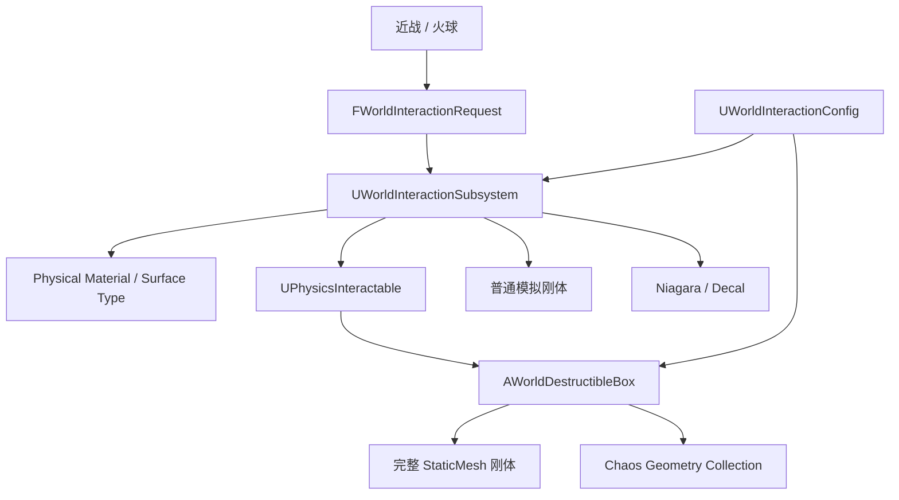

# UE5 Open-Area Physics Interaction Demo

基于 Unreal Engine 5.8 的第三人称开放区域物理交互垂直切片，当前重点是将近战与火球命中转换为可复现的刚体、Chaos 破坏、表面识别和反馈生命周期。

| 项目项 | 当前状态 |
|---|---|
| 引擎 | Unreal Engine 5.8 |
| 类型 | C++ 技术演示 / 物理交互作品集 |
| 当前版本 | P0 交互闭环 |
| 核心技术 | Chaos、Geometry Collection、Niagara、Physical Material、Editor Scripting、无头 PIE |
| 公开仓库定位 | 源码、工具、技术文档与自制物理内容展示 |

> 本项目是非官方技术学习与作品集项目，与相关游戏开发商无隶属或授权关系。角色、动作、贴图和武器来自单独取得的第三方素材，其条款禁止公开再分发，因此这些资产不包含在本仓库中。详见 [THIRD_PARTY_NOTICES.md](./THIRD_PARTY_NOTICES.md)。

## 项目概述

本地完整演示中，玩家可以使用近战或火球攻击环境。命中首先转换为统一的 `FWorldInteractionRequest`，由 `UWorldInteractionSubsystem` 解析表面类型、路由接收者并分发表现，再驱动完整刚体、Chaos Geometry Collection、Niagara 和灼烧贴花。

角色移动与地面三连是稳定的交互载体；当前作品集主线不是继续扩充招式数量，而是完成一个参数可解释、结果可测量、流程可回归的物理交互垂直切片。

## 已实现内容

### 物理交互 P0

- 近战和火球统一提交标准化环境交互请求；
- Physical Material / Surface Type 识别；
- 定向冲量、径向爆炸和普通模拟刚体响应；
- 完整木箱刚体到 Chaos Geometry Collection 的破裂接管；
- 单箱质量覆盖与项目统一世界重力；
- Wood 表面反馈、Niagara 占位效果和灼烧贴花；
- 火球、碎片和贴花的受控生命周期；
- 5 个木箱实例的半径交互与清理验证。

### 角色与战斗载体

- Idle / Walk / Run / Sprint、方向 BlendSpace；
- 起跳、二段跳、下落和三类落地反馈；
- Sprint 180 度回身、左右脚急停和相机自动回正；
- 地面轻攻击三连及输入缓冲；
- 第一段左手持刀，第二、三段右手持刀；
- Recovery 阶段移动或跳跃取消；
- 攻击期间暂停相机自动跟随，保持玩家视角控制；
- 训练靶、生命值、伤害和轻受击反馈。

### 工具与验证

- C++ Runtime 与 Editor 模块分离；
- Python + Editor C++ 生成 AnimBP、BlendSpace 和 Fracture 资产；
- PowerShell 统一封装构建与无头 PIE；
- 武器 Sweep 可视化；
- 质量、重力、破裂、表面和生命周期专项验证。

## 操作方式

以下按键对应本地完整演示；公开仓库不附带第三方角色内容。

| 输入 | 功能 |
|---|---|
| `WASD` | 移动 |
| 鼠标 | 控制视角 |
| `Left Shift` | Sprint |
| `Space` | 跳跃 / 二段跳 |
| `C` | 落地翻滚修饰 |
| 鼠标左键 | 地面轻攻击 |
| `Q` | 发射火球 |

## 核心架构



| 模块 | 职责 |
|---|---|
| `RoverReplica` | 角色、移动、动画镜像、战斗、交互、火球和木箱运行时 |
| `RoverReplicaEditor` | AnimGraph、资产生成、Fracture 和 PIE 测试辅助 |
| `UWorldInteractionSubsystem` | 请求校验、表面解析、接收者路由和共享反馈 |
| `UPhysicsInteractable` | 环境对象接收统一交互请求的接口 |
| `AWorldDestructibleBox` | 生命、完整刚体、GC 接管、破裂和回收 |
| `UWorldInteractionConfig` | 重力、火球、爆炸、木箱、表面和生命周期参数 |

角色和战斗只负责产生请求，不直接依赖木箱、贴花或 Niagara。环境服务使用随 World 创建和销毁的 `UWorldSubsystem`，不依赖关卡中的 Manager 蓝图。

## 技术实现

### 武器 Sweep

高速刀刃判定使用空间采样和时间子步组合：

- 刀根到刀尖 7 点采样；
- 端点每移动 10 cm 增加一次子步；
- 单帧最多 8 个子步；
- 补充刀身横向 Sweep；
- 每个 Actor 每段攻击只结算一次；
- 青色表示未命中、红色表示命中、绿色/紫色表示刀根/刀尖。

```text
rover.combat.DrawAttackTrace 0/1
rover.combat.DrawAttackTraceDuration <seconds>
```

### Geometry Collection 生成与优化

木箱使用固定随机种子生成 16 个 Voronoi 碎片、1 个根 Cluster 和 17 个 convex implicits。生成器会补齐 GeometryDependentProperties、SimulatableParticles 和 Chaos simulation data，并通过版本属性检测旧资产。

定位到 PlanarCut 在零噪声时仍以 `PointSpacing=1cm` 重拓扑内部面后，将无噪声内部面间距调整为 `100cm`：

| 指标 | 优化前 | 优化后 |
|---|---:|---:|
| 内部面数量 | 245,992 | 412 |
| GC 资产大小 | 22,121,017 bytes | 168,563 bytes |
| 碎片与碰撞结构 | 16 碎片 | 保持不变 |

### 完整刚体到碎片的接管

破裂前由 StaticMesh 负责稳定碰撞和实例质量；破裂时读取 World Transform、Scale、线速度和角速度，关闭完整网格，再将运动状态交给预热的 Dynamic Geometry Collection Proxy。随后开启 GC 重力和碰撞，提交 External Strain、Breaking Velocity 和冲量，最后显示碎片。

每个木箱拥有 transient Wood Physical Material，根据目标质量和 GC 原始质量换算密度，使完整刚体与 Chaos 使用一致的质量语义，同时避免不同实例污染共享材质。

## 量化验证基线

以下数据来自 2026-08-06 的本地完整项目构建和无头 PIE 日志。

| 验证项 | 结果 |
|---|---|
| Editor 构建 | Runtime / Editor 模块通过 UE 5.8 Editor 构建 |
| 近战破箱 | Attack01 伤害 100，木箱 `25 -> 0`，1 请求 / 1 接收者 |
| 相机控制 | 攻击期间最大方向误差 `0.00deg` |
| 武器 Trace | `(Radius, Samples, Step, MaxSubsteps)=(20,7,10,8)` |
| 质量一致性 | 完整箱与 GC 均为 `35.00kg`；运行时探针均可切换到 `52.50kg` 后恢复 |
| 统一重力 | `-980cm/s²`；0.208 s 实测位移 `-22.3cm`，理论 `-21.2cm` |
| 自由落体速度 | 实测 `-203.6cm/s`，理论 `-203.9cm/s` |
| 完整 P0 | 5 个箱子接收爆炸请求，GC / 贴花激活并完成生命周期清理 |

## 仓库结构

```text
Source/
  RoverReplica/                 Runtime C++
  RoverReplicaEditor/           Editor 工具与测试辅助

Content/PhysicsWorldDemo/       自制 Config、GC、材质、网格和 Niagara 占位资产
Scripts/                        资产生成、构建和无头 PIE 验证
Docs/Roadmap.zh-CN.md           分阶段开发规划
Config/                         项目配置（已移除本机令牌）
```

`Content/Rover/` 不在公开仓库中。仓库可用于源码审阅和 Editor 模块构建，但不能直接还原本地完整角色表现或运行全部 PIE 验证。

## 环境与构建

要求：

- Windows 10 / 11；
- Unreal Engine 5.8；
- Visual Studio 2022，安装 Desktop development with C++ 和 Game development with C++；
- Git LFS。

```powershell
git lfs install
git clone <repository-url>
cd <repository-directory>

powershell -File .\Scripts\BuildEditor.ps1 `
  -EngineRoot "C:\Program Files\Epic Games\UE_5.8" `
  -StageRoot "$env:TEMP\PhysicsWorldDemoBuild" `
  -SkipSync
```

脚本会在临时目录构建 `RoverReplicaEditor`，避免中文工程路径影响 UBT。`-EngineRoot` 应改为本机 UE 5.8 安装目录。

完整内容工程的常用回归入口：

```powershell
powershell -File .\Scripts\ValidateRoverPIE.ps1 -EngineRoot <UE5.8-path>
powershell -File .\Scripts\ValidateRoverCombatP0PIE.ps1 -EngineRoot <UE5.8-path>
powershell -File .\Scripts\ValidatePhysicsWorldBoxPhysicsPIE.ps1 -EngineRoot <UE5.8-path>
powershell -File .\Scripts\ValidatePhysicsWorldMeleeBoxPIE.ps1 -EngineRoot <UE5.8-path>
powershell -File .\Scripts\ValidatePhysicsWorldP0PIE.ps1 -EngineRoot <UE5.8-path>
```

这些 PIE 脚本需要未公开的合法角色资产和完整测试关卡；公开仓库中的验证源码用于展示测试设计，不承诺在缺失资产时直接通过。

## 当前限制与路线图

- 当前 Niagara、木箱材质和贴花仍是 P0 占位表现；
- 只有 Wood 完成真实装配和自动化验证；
- ChaosNiagara 插件已启用，但尚未接入 Chaos Solver 破裂事件数据接口；
- Chaos Cloth、全局风、草地 WPO、Water、PCG、World Partition 和 HLOD 尚未完成；
- 当前没有正式的 p50 / p95、内存和流送性能报告；
- 完整闪避、重击、空中战斗、锁定和敌人 AI 不属于当前完成范围。

后续顺序是先提升 Wood / Stone / Metal 的差异化反馈和营地场景质量，再接全局风与 Chaos Cloth，最后使用 PCG、World Partition / HLOD 和固定路线性能数据证明规模化能力。

详细规划见 [Docs/Roadmap.zh-CN.md](./Docs/Roadmap.zh-CN.md)。

## 资产与授权

- 本仓库不包含第三方角色、动作、贴图、武器或原始 FBX；
- 相关游戏名称、角色与商标归各自权利人所有；
- Unreal Engine 及其内容的使用受 Epic Games 对应许可约束；
- 当前仓库未附开放源码许可证，代码仅用于作品集审阅；如需复用，请先联系仓库所有者。
