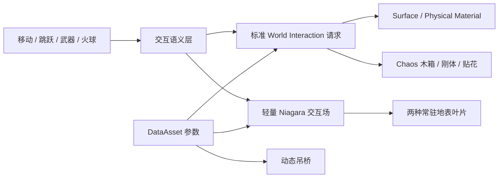

# UE5 Open-Area Physics Interaction Demo

**[观看 32 秒实机演示（MP4，约 20 MB）](./Docs/Media/physics-interaction-demo-2026-08-09.mp4)**

这是一个基于 Unreal Engine 5.8 制作的开放区域物理交互垂直切片。项目保留成熟的第三人称移动与战斗作为玩家输入载体，重点设计的是：玩家怎样用已经掌握的移动、跳跃、近战和火球改变环境，以及环境怎样用重量、方向、范围、余振和恢复过程给出可读反馈。

| 项目项 | 当前定位 |
|---|---|
| 作品集方向 | 大世界交互策划 / 技术美术（物理方向） |
| 当前场景 | 营地交互垂直切片 |
| 核心案例 | 两种常驻地表叶片（刀路尾流 / 动态边界）、一刀破箱 / 范围爆炸、保留攻击位移的 60 板动态吊桥 |
| 我的职责 | 体验规则、反馈分级、参数体系、UE 原型实现、调试与验收 |
| 技术基线 | Chaos、Geometry Collection、Niagara、Physical Material、Physics Constraint、Editor Scripting、无头 PIE |

> 当前作品证明的是一套可以演示、调参和回归的环境交互语言，不用 100m 级测试场地直接宣称已经解决“大世界”。World Partition、HLOD、LWC 远原点和多区域性能证据仍属于后续阶段。

## 我想解决的体验问题

开放区域里的物理效果不能只在技能命中时热闹一下。玩家应该能从环境变化中判断自己做了什么：慢走只轻微拨动地表杂物，奔跑留下更明显的尾流，刀锋沿真实挥砍方向带动落叶，落地体现下坠速度，爆炸表达更大的影响半径；动态桥面则用承重、摆动和衰减告诉玩家脚下并非静态装饰。

本项目用四条规则约束所有实现：

1. **不增加演示专用操作**：物理交互复用移动、跳跃、近战和火球；
2. **反馈必须有层级**：行走 < 奔跑 < 落地 / 攻击 < 爆炸，但方向和作用方式也必须不同；
3. **表现不能抢控制权**：环境可以动，不能反向拉镜头、改变攻击朝向或让可通行路径失控；
4. **结果必须可解释**：作用范围、命中时机、冲量来源、生命周期和失败边界都要能观察和回归。

## 玩家现在能体验到什么

下表描述已经接通的玩家输入、环境响应规则与运行时参数链。木箱和吊桥已有 Chaos 行为证据；Loose Debris 的事件发布、空间覆盖、预算和静止参数已通过无头 PIE，粒子最终姿态与强弱仍以有渲染 PIE 为准。

| 玩家行为 | 环境反馈 | 玩家应读到的信息 |
|---|---|---|
| 站在落叶区域不动 | 常驻总量持续受控；回落、减速与静止参数链已接入 | 场景先于玩家存在，不是循环喷发特效 |
| 行走 / 奔跑 | 同一批地表杂物被脚步和速度尾流带动，奔跑明显强于行走 | 环境能反映移动强度与方向 |
| 起跳 / 落地 | 起跳表达蹬地，落地按接触前垂直速度产生更大径向反馈 | 垂直动作具有重量差异 |
| 空挥近战 | 刀锋有效帧也会扰动地表，不要求先命中 Actor | 刀路本身就是空间交互输入 |
| 攻击扫过落叶 | 贴地粒子先被掀起，再沿挥砍方向形成短尾流 | 攻击是定向切割，不是圆形爆炸 |
| 近战命中木箱 | 第一刀立即破裂，碎片继承方向并受质量、阻尼和重力约束 | 武器确实接触了物体 |
| 发射火球 | 范围内多个木箱分别响应，叠加爆炸、木屑和灼烧痕迹 | 同一协议可以从单点升级为范围事件 |
| 站上 / 经过 / 桥上攻击 | 桥面承重、下沉、晃动；攻击保持前移但明显弱于落地；离开后恢复自然弧线 | 动态路径能区分持续载荷、战斗推进和垂直冲击 |
| 按 `Caps Lock` 打开调试可视化 | 同时显示武器 Sweep 与轻量交互场的位置、方向和半径 | 反馈结果可以解释和手调；关闭绘制不改变命中、伤害或粒子受力 |

## 我的工作方式：先定义环境语言，再选择技术

我把当前交互分成两层：

- **玩法物理**：木箱和吊桥有真实刚体、质量、碰撞、破坏或通行语义，由 Chaos 和 Physics Constraint 负责；
- **表现物理**：两种轻质叶片用于放大玩家速度、刀路与冲击，不承担阻挡、伤害和网络权威，由 Niagara 负责。

两层共享玩家输入，但不共享强度常量。调高落叶尾流不会让吊桥突然剧烈抖动，调整木箱破裂冲量也不会改变地表杂物密度。



## 案例一：常驻、可反复交互的地表轻质杂物

### 体验定义

两种叶片属于场景，而不是角色技能的附属粒子。区域内保持约 `450` 个 Ambient 粒子的稳态预算，单粒子寿命约 `30s` 并持续轮换。移动、攻击、起跳、落地和爆炸只改变当时已经存在的粒子，不为每次交互重新生成 Niagara System。

当前 P0 使用 CPU Sim Ambient System 和 Dynamic Bounds，目的是先证明交互规则、碰撞沉降、贴地再激活、镜头裁剪稳定性和调参链路。Niagara Data Channel 已建立并写入，但当前 Region 主要通过 Subsystem 委托和 User 参数驱动 Ambient；GPU / Islands 扩量需要在相同场景下做 A/B 性能测试后再决定。

### 攻击为什么不是单一排斥力

只做径向排斥会让挥刀看起来像小爆炸；只做前方吸引又难以带动已经贴地的粒子。当前攻击叠加两股短时力：

1. 地面下方、略偏刀路后方的排斥力负责把粒子掀起；
2. 刀路前上方的吸引力负责把粒子沿攻击方向牵引一小段。

尾流拥有独立 `0.20s` 计时，不会被角色下一帧移动事件提前清掉。武器 Trace 可以有多个刀身采样和时间子步，但 Niagara 仍限制为每攻击来源每帧一个场，避免判定精度直接放大表现成本。

### 怎样让它停下来，又能再次被影响

Ambient 粒子不能永久进入不可唤醒的 Rest State，否则落地后下一刀无法再带动。当前源码与已重建的 Schema 资产把持续旋转驱动力设为 `0/0`、旋转阻尼设为 `8`、碰撞 Restitution 设为 `0`、Resting / Bouncing Calming Rate 设为 `12`；无头 PIE 已确认运行时读取 `0/0@8`。目标是在保留下一次 Point Force 响应的同时耗散持续自转；最终是否自然仍以有渲染 PIE 为观感出口，不能仅凭参数断言画面已经通过。

### 镜头向下时为什么曾整片消失

粒子生命周期、持续生成和碰撞都没有中断，但镜头轻微向下时整片落叶会同时不可见。根因不是数量不足，而是世界空间粒子继续移动后超出 Niagara 的 Fixed Bounds；固定包围盒离开视锥时，Renderer 会把整套 System 一起裁掉。

当前 Leaf / Paper Emitter 改为 CPU Dynamic Bounds，由实际粒子位置逐帧更新包围范围。`Pitch=-45deg` 下的纯 Ambient 与交互预览均保持可见；约 `450` 粒子的单 Region 只是当前 P0 取舍，正式 CPU Bounds 成本仍待固定硬件测量。该修复解决的是“整片同时消失”，不把个别 Sprite 贴地变薄或闪烁混成同一个问题。

### 两种叶片外观

原来的白色 Paper Sprite 已改成第二种浅色五瓣叶片，交互参数、碰撞与力场语义保持不变。内部仍保留 `Paper*`、`M_LooseDebris_Paper` 等兼容命名，避免一次美术替换扩散成运行时 Schema 迁移。第二种叶片取自 `T_Fol_Leafs_BC` 图集，裁切为 UV Offset `(769/2048, 186/2048)`、Scale `(216/2048, 216/2048)`；该商业图集只存在于合法的完整本地工程，不随公开仓库分发。

完整设计、参数和失败复盘见 [2026-08-09 交互设计日志](./Docs/InteractionDesignLog-2026-08-09.zh-CN.md) 与 [Niagara 地表轻质杂物交互系统说明](./Docs/Niagara地表轻质杂物交互系统方案.md)。

## 案例二：一刀破坏木箱

木箱承担最基础的“攻击环境”教学。玩家不需要新按键，只要让真实刀身 Sweep 在 Active 窗口扫到箱体，第一刀就会触发破坏。

完整本地 Demo 已在 `ExampleMap_Lumen` 使用 `SM_WoodenBox1` 制作对应破裂 Geometry Collection，并完成手动 PIE 破裂确认。Runtime 通过可编辑 Soft Object Reference 优先装配该展示外观，资源缺失时回退到仓库内的 `SM_Demo_WoodenCrate / GC_Demo_WoodenCrate_Fractured`；公开仓库不分发商业 Mesh、派生几何或该关卡的 External Actor。

- 完整态是开启 Simulate Physics 的 StaticMesh 刚体；
- 当前质量基线约 `80kg`，世界重力统一为 `-980cm/s²`；
- 破裂时把 Transform、线速度和角速度交给 Geometry Collection；
- 16 个 Voronoi rigid leaves 使用单根 Cluster；
- Fracture 生成曾因无噪声切面仍按 `1cm` 重拓扑，内部面达到 `245,992`；将无噪声间距调整为 `100cm` 后降到 `412`，资产由约 `22.1MB` 降到 `168KB`，碎片结构不变；
- 碎片使用更高阻尼和明确生命周期，避免纸片感与长期堆积；
- `OnChaosBreakEvent` 只在真实破裂后触发木屑 Niagara，不用预设时间假装破裂。

武器调试入口：

```text
rover.combat.DrawAttackTrace -1/0/1
rover.combat.DrawAttackTraceDuration <秒>
```

调试颜色区分未命中 / 命中 Sweep、刀根与刀尖，便于直接调整第一刀碰撞出现时机、半径和覆盖范围。

## 案例三：火球与多目标范围反馈

火球用于验证同一交互协议能否从单点命中升级为范围事件：

- 投射物按相机视线飞行，命中后只提交一次 Explosion 请求；
- Subsystem 解析 Physical Material / Surface Type；
- 范围内对象各自决定是否破裂、受冲量或忽略；
- Wood 当前完成真实装配，Stone / Metal / Grass / Water / Cloth 已有协议槽位但视觉差异仍待打磨；
- 爆炸 Niagara、木屑、灼烧贴花、投射物和碎片均有数量或时间上限；
- 同一次爆炸还会向常驻杂物发布纯表现轻量场，但不会把 Niagara 强度反写到木箱或吊桥。

近战强调时机与方向，火球强调范围和同时响应。二者共享环境协议，不为每个技能复制一套木箱逻辑。

## 案例四：保留攻击位移的 60 板动态吊桥

吊桥被定义为开放区域中的动态通行节点。已记录的演示实例桥面约 `16.77m x 4.00m`，由 `60` 块独立物理木板、`4` 个端点挂点和 `122` 个约束组成；最新结构专项再次确认板数、挂点与约束数，但没有把尺寸作为该轮输出项。

当前参数权威已经从关卡实例迁入 `DA_WorldInteractionConfig.Settings.RopeBridge`：从实机 Demo 的 `OverrideSettings` 一次性复制完整 `58` 个字段后，`BP_RopeBridge` CDO 与关卡实例均关闭 Override。旧实例 payload 被保留用于审计，但不再参与运行；蓝图、实例、调参脚本和专项验证统一读取共享 DataAsset，避免“关卡看起来调对了、全局配置却没有生效”。

宽桥最初使用单条中轴约束，角色踩在木板一侧时会形成较大横向力臂，长链出现麻花状扭转。当前每道板缝改为左右双侧受力点：主约束控制链长和前后俯仰，副约束提供横向几何稳定，避免两套完整约束互相争抢。

| 体验问题 | 当前规则 / 证据 |
|---|---|
| 桥是否像可通行路径 | 60 板，约 `16.77m x 4.00m` |
| 是否有自然弧线 | 初始下垂 `80cm` |
| 是否有重量 | 单板 `15kg`，角色持续承重 |
| 跑步是否强于走路 | 最新输入冲量 `123.4 > 46.9` |
| 离开后是否无限晃 | 10 秒后速度归零，自然姿态误差 `1.13°` |
| 是否会横向扭曲 | 59 对双侧板缝约束抑制横滚 |
| 攻击是否保留位移 | 相对脚下板向攻击方向前移 `18.3cm` |
| 攻击是否会盖过落地 | Attack `90.2cm/s`，Landing `309.3cm/s`，比值 `0.292` |

这轮解决的关键不是把整座桥调硬，而是拆开不同物理语义。动态底座攻击推进改为平滑 `ConstantForce`，使用距离倍率 `0.55`、时长倍率 `2.50` 和完整 Ease；角色站立载荷仍为 `1.0`，没有靠减轻角色重量稳定桥面。桥板 DirectHit 由接收者按 `0.05` 倍、最大 `50` 自行消费，木箱通用冲量和 Explosion 径向冲量保持独立。桥自身只在攻击推进及其 `1.0s` 余量窗口使用 `4x / 6x` 线性与角向阻尼。

专项连续执行两次 Attack01 并取最大值。共享配置迁移后的攻击峰值为 `90.2cm/s / 206.0deg/s`，落地 `309.3cm/s`，Attack / Landing 线速度比 `0.292`；攻击额外桥体 Movement Impulse、CharacterMovement Push Force 和 World Interaction 均为 `0`，离桥恢复为 `0/0`，自然姿态误差 `1.13deg`。下一阶段仍需补真实刀刃直击桥板、Explosion 压力、多桥性能和有渲染手感验收。

完整说明见 [物理吊桥系统说明](./Docs/物理吊桥系统说明.md)。

## 这次迭代纠正了什么

| 表现问题 | 原因 | 处理 |
|---|---|---|
| 每次交互重新出现粒子 | 把环境误做成事件 Burst | 常驻 Ambient 总量，事件只扰动已有粒子 |
| 玩家所有行为都没反馈 | Niagara 模块绑定失败仍被工具当成成功 | 绑定失败向上传播，配置脚本直接失败 |
| DataAsset 手调不生效 | 旧资产值、Rapid Iteration 与 User 参数路径混用 | 统一运行时 User 参数，并加一次性资产 Schema 迁移 |
| 地上的粒子无法再次响应 | 一次性 Rest / Burst 生命周期与常驻需求冲突 | 通过阻尼和 Calming 静止，保留可再次受力 |
| 攻击只有圆形排斥 | 缺少沿刀路的方向目标 | 增加独立前上方吸引尾流 |
| 爆炸参数变强却覆盖不到粒子 | 力源偏移到了自身半径外 | Point Force 原点限制在 `0.8R` 内 |
| 落叶一直转圈 | 持续旋转驱动、角阻尼不足、碰撞微能量 | 已完成 Rotation `0/0`、Rotational Drag `8`、Restitution `0` 的源码与迁移逻辑，待有渲染验收 |
| 镜头向下时整片杂物消失 | 世界空间粒子超出 Fixed Bounds 后整套 Renderer 被视锥裁剪 | CPU Emitter 改为 Dynamic Bounds，并用 `Pitch=-45deg` 预览确认仍可见 |
| 桥上普通攻击接近落地强度 | 推进载荷、桥板直击和通用环境冲量共用物理路径 | 拆分推进 / DirectHit / 通用冲量 / Explosion，并增加桥侧战斗阻尼窗口 |
| 编辑器里调试形状总是显示 | 编辑器默认 CVar 强制开启，无法跟随 DataAsset | 两个 CVar 改为 `-1/0/1` 三态，并用 `Caps Lock` 同步切换 |
| 吊桥实例参数与共享配置分叉 | 关卡 `OverrideSettings` 长期成为隐形权威 | 迁移 58 字段到共享 DataAsset，CDO / 实例关闭 Override，专项验证比较完整 Struct |
| 重击·鸣奏收招短暂闪回站立 | Montage Blend Out 太短 | Blend Out 与 Trigger Time 从 `0.15s` 调到 `0.25s`，给全身过渡留出混合时间 |

这些修复的共同标准是：不靠缩短寿命或隐藏对象掩盖问题，而是找到输入、空间覆盖、能量来源和生命周期之间的真实矛盾。

## 参数与调试入口

| 资产 / 命令 | 用途 |
|---|---|
| `DA_WorldLooseDebrisConfig` | 常驻密度、走跑、攻击尾流、跳跃 / 落地、爆炸、阻尼与静止 |
| `DA_WorldInteractionConfig` | 世界重力、火球、爆炸、木箱、表面反馈、贴花和吊桥 |
| `DA_RoverCombatConfig` | 武器 Active 时机、Trace、攻击方向与环境请求强度 |
| `Caps Lock` | 游戏内同步开关武器 Sweep 与 Loose Debris 力场；只改变绘制 |
| `pw.LooseDebris.DrawFields -1/0/1` | `-1` 跟随 `bDrawDebugFields`，`0` 强制关闭，`1` 强制开启 |
| `rover.combat.DrawAttackTrace -1/0/1` | `-1` 跟随 `bDrawAttackTrace`，`0` 强制关闭，`1` 强制开启 |

普通数值调整集中在 DataAsset，修改后重新开始 PIE 即可读取；Niagara 图结构、User 参数绑定或资产 Schema 变化通过 `ConfigurePhysicsWorldLooseDebris.ps1` 重建。配置脚本只做版本化迁移，不应反复覆盖策划已经手调的值。

## 验收不是一个 `PIE_OK`

自动化负责证明协议、预算和生命周期；有渲染 PIE 负责判断画面与手感。两者不能互相替代。

| 验收层 | 当前检查内容 |
|---|---|
| Build | Runtime / Editor 模块在 UE 5.8 编译通过 |
| 基础角色 PIE | GameMode、Pawn、输入、移动、跳跃和相机不回归 |
| 木箱专项 | 一刀破坏、质量 / 重力、GC 接管、表面解析和清理 |
| 吊桥专项 | 板数、约束数、误差、承重、恢复和输入来源诊断 |
| Loose Debris 专项 | 静止不发场、移动 / 空挥 / 跳跃 / 落地 / 爆炸、攻击尾流、覆盖、限流、`interaction_systems=0` |
| 视觉检查 | 密度、方向、穿地、持续旋转、落地再激活、走跑和落地强度层级 |
| 性能检查 | Niagara Debugger、`stat Niagara`、Insights、固定路线的 p50 / p95；尚待正式基线 |

2026-08-09 本机回归记录：

| 脚本 | 关键证据 | 结果 |
|---|---|---|
| `BuildEditor.ps1` | Runtime / Editor 模块，UE 5.8 Development Editor | 通过 |
| `ValidatePhysicsWorldLooseDebrisPIE.ps1` | 第二叶片资产回归：Movement / Attack / Jump / Landing / Explosion 来源均被观察；`interaction_systems=0`、NDC 写入 `33`、空间覆盖与贴地投影有效 | 通过 |
| `ValidatePhysicsWorldBoxPhysicsPIE.ps1` | 完整箱 / GC `80kg`、质量相关破裂冲量、重力 `-980cm/s²`、GC 接管连续、碎片展开 `20.1cm` | 通过 |
| `ValidatePhysicsWorldRopeBridgePIE.ps1` | 共享配置一致；`60` 板 / `122` 约束；Attack `90.2cm/s`、Landing `309.3cm/s`、比值 `0.292`；相对推进 `18.3cm`；恢复 `0/0` | 通过 |
| `ValidateRoverPIE.ps1` | GameMode、Pawn、运行时 Input Context 激活与跳跃冒烟 | 通过 |

这些数字证明协议、行为层级和资产状态可回归，不等于最终 VFX 画面、吊桥美术观感或大世界性能已经验收。

最新分阶段规划见 [Roadmap](./Docs/Roadmap.zh-CN.md)。

## 当前边界

- 第三方角色、动作、武器和原始 FBX 不作为原创资产申报，也不包含在公开仓库；
- 本地 Demo 使用 `ModularLostRuinKit` 的叶片图集与木箱外观；公开仓库只保留自制材质 / Niagara / 破坏逻辑和软引用，不分发源贴图、Mesh 或关卡 External Actor；
- 当前 Niagara 杂物是视觉粒子，不宣称拥有真实 kg、权威碰撞或网络同步；
- 当前 CPU Sim P0 不等于已经证明 GPU 大规模方案；
- Wood 的物理和反馈链最完整，其他表面仍需差异化美术与声音；
- 吊桥攻击 / 落地自动层级已通过，但真实刀刃直击、Explosion、多桥性能和有渲染体验仍待验收；
- 无头 PIE 没有像素证据，最终 VFX 观感必须在有渲染运行中确认；
- 当前没有提交多 Cell、远原点、World Partition / HLOD 和固定硬件性能结论。

## 操作方式

| 输入 | 功能 |
|---|---|
| `WASD` | 移动并影响地表轻质杂物 |
| 鼠标 | 自由观察 |
| `Left Shift` | 奔跑 |
| `Space` | 跳跃 / 二段跳，起跳与落地发布独立环境反馈 |
| 鼠标左键 | 近战；刀锋有效帧同时影响木箱与常驻杂物 |
| `WASD + 攻击` | 每段重新选择攻击方向 |
| `Q` | 发射火球并产生范围爆炸 |
| `Caps Lock` | 游戏内同步开关武器碰撞与轻质杂物力场可视化 |

## 文档索引

- [2026-08-09：Niagara 常驻地表杂物交互复盘](./Docs/InteractionDesignLog-2026-08-09.zh-CN.md)
- [2026-08-09：吊桥攻击响应分层复盘](./Docs/InteractionDesignLog-2026-08-09-RopeBridgeAttackResponse.zh-CN.md)
- [Niagara 地表轻质杂物交互系统说明](./Docs/Niagara地表轻质杂物交互系统方案.md)
- [2026-08-08：扩展交互输入系统](./Docs/InteractionDesignLog-2026-08-08.zh-CN.md)
- [2026-08-07：动态吊桥结构与体验调优](./Docs/InteractionDesignLog-2026-08-07.zh-CN.md)
- [物理吊桥系统说明](./Docs/物理吊桥系统说明.md)
- [阶段路线图](./Docs/Roadmap.zh-CN.md)

<details>
<summary><strong>构建与验证</strong></summary>

要求：Windows 10 / 11、Unreal Engine 5.8、Visual Studio 2022、Git LFS。

```powershell
git lfs install
git clone https://github.com/GoodNatGod/UE5-Physics-Interaction-Demo.git
cd UE5-Physics-Interaction-Demo

powershell -File .\Scripts\BuildEditor.ps1 `
  -EngineRoot "C:\Program Files\Epic Games\UE_5.8" `
  -StageRoot "$env:TEMP\PhysicsWorldDemoBuild" `
  -SkipSync
```

完整本地项目常用入口：

```powershell
powershell -File .\Scripts\ConfigurePhysicsWorldLooseDebris.ps1 -EngineRoot <UE5.8-path>
powershell -File .\Scripts\ValidatePhysicsWorldLooseDebrisPIE.ps1 -EngineRoot <UE5.8-path>
powershell -File .\Scripts\ValidatePhysicsWorldBoxPhysicsPIE.ps1 -EngineRoot <UE5.8-path>
powershell -File .\Scripts\ValidatePhysicsWorldP0PIE.ps1 -EngineRoot <UE5.8-path>
powershell -File .\Scripts\ValidatePhysicsWorldRopeBridgePIE.ps1 -EngineRoot <UE5.8-path>
powershell -File .\Scripts\ValidateRoverPIE.ps1 -EngineRoot <UE5.8-path>
```

部分 PIE 验证依赖未公开的合法角色资产、`ModularLostRuinKit` 图集与完整测试关卡，因此公开仓库主要用于作品集审阅、规则复盘、自制物理资产和源码检查。`ConfigurePhysicsWorldRopeBridge.ps1 -SyncSharedConfigFromDemo` 也只适用于拥有明确 `SourceMapPath` 的完整本地工程。

</details>

## 资产与授权

本仓库只公开源码、工具、自制物理内容与实机视频，不包含第三方角色、动作、贴图、Mesh、武器、完整关卡或原始 FBX。相关角色与商标归各自权利人所有；本项目与相关游戏开发商无隶属或授权关系。详见 [THIRD_PARTY_NOTICES.md](./THIRD_PARTY_NOTICES.md)。
